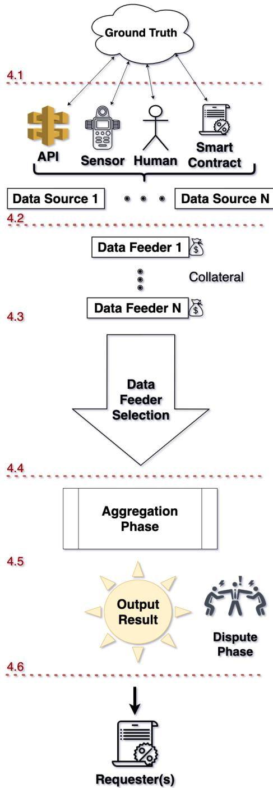
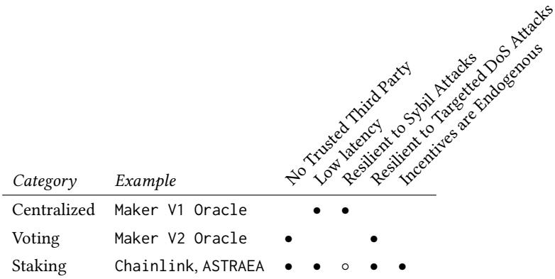
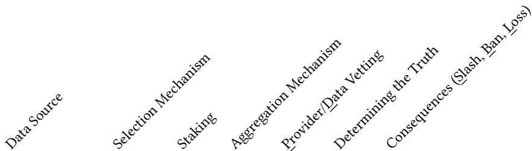

# SoK: Oracles from the Ground Truth to Market Manipulation

Shayan Eskandari∗ Concordia University Montreal, QC, Canada ConsenSys Diligence Brooklyn, NY, USA

Wanyun Catherine Gu Stanford University Stanford, CA, USA

Mehdi Salehi∗ Concordia University Montreal, QC, Canada

## ABSTRACT

## 1 INTRODUCTION

One fundamental limitation of blockchain-based smart contracts is that they execute in a closed environment. Thus, they only have access to data and functionality that is already on the blockchain, or is fed into the blockchain. Any interactions with the real world need to be mediated by a bridge service, which is called an oracle. As de centralized applications mature, oracles are playing an increasingly prominent role. With their evolution comes more attacks, necessitating greater attention to their trust model. In this systemization of knowledge paper (SoK), we dissect the design alternatives for oracles, showcase attacks, and discuss attack mitigation strategies.

Jeremy Clark Concordia University Montreal, QC, Canada j.clark@concordia.ca

## ACM Reference Format:

Shayan Eskandari, Mehdi Salehi, Wanyun Catherine Gu, and Jeremy Clark. 2021. SoK: Oracles from the Ground Truth to Market Manipulation. In 3rd ACM Conference on Advances in Financial Technologies (AFT ’21), September 26–28, 2021, Arlington, VA, USA. ACM, New York, NY, USA, 15 pages. https: //doi.org/10.1145/3479722.3480994

With billions of dollars at stake, decentralized networks are prone to attacks. It is essential that the smart contracts, which govern how systems are run on these networks, are executed correctly. Public blockchains, like Ethereum, ensure the correct execution of smart contract code by taking the consensus of a large, open network of nodes operating the Ethereum software. For consensus to form, many nodes need to make decisions based on the exact same input data. Hypothetically, if a decision requires nodes to fetch data or use a service provider outside of the blockchain, there can be no guarantee that every node in a global network has the same access and view of this external source. For this reason, blockchains only execute on internal sources: data and code provided in a current transaction, or past data and code already stored on the blockchain.

Many potential decentralized applications seem very natural until the designer hits the ‘oracle problem’ and realizes an interface to the external world is required. An oracle is a solution to this problem. It is a service that feeds of-chain data into on-chain storage. The trust model of oracles vary—some data comes with cryptographic certification while other data is assumed to be true based on trusting the oracle, or a set of oracles. Oracle-supplied data cannot easily be changed or removed once finalized on-chain, allowing disputes over data accuracy to be based on a public record. Leveraging this immutability is one approach to incentivizing oracles to post truthful information.

We aim to construct in this paper a systematization ofknowledge (SoK) of implementation choices for oracles, facilitated by breaking down the operation of an oracle into a set of modules. For each module, we explore potential system vulnerabilities and discuss attack vectors. We also aim to categorize all the significant oracle proposals of diferent projects within a taxonomy we propose. The goal of this SoK is to help the reader better understand the system design for oracles across diferent use cases and implementations.

## 2 PRELIMINARIES

Ethereum [111] is a prominent public blockchain with the largest developer headcount. While oracles are applicable to any blockchain, we will adopt Ethereum as a concrete example of a blockchain for the purposes of explaining each concept in this paper. Ethereum is inspired by Bitcoin but adds a verbose language for programming smart contracts that execute on the Ethereum Virtual Machine (EVM). All transactions and executions are verified by a decentral ized network of nodes. Solidity is the main high-level programming language used by developers for developing smart contracts and decentralized applications (DApps). Smart contracts are small code bases that live on a blockchain. In short, smart contracts can be seen as blackbox applications that get inputs from a user and follow the code flow to the output, which can update the state of the contract and trigger monetary transactions.

The Oracle Problem. Smart contracts cannot access external resources (e.g., a website or an online database) to fetch data that resides outside of the blockchain (e.g., a price quote of an asset). External data needs to be relayed to smart contracts with an oracle. An oracle is a bridge or gateway that connects the of-chain real world knowledge and the on-chain blockchain network. The ‘oracle problem’ [22] describes the limitation with which the types of applications that can execute solely within a fully decentralized, adversarial environment like Ethereum. Generally speaking, a pub lic blockchain environment is chosen to avoid dependencies on a single (or a small set) of trusted parties. One of the first oracle implementations used a smart contract in the form of a database (i.e., mapping1) and was updated by a trusted entity known as the owner. More modern oracle updating methods use consensus protocol with multiple data feeds or polling techniques based on the ‘wisdom of the crowd’. The data reported by an oracle will always introduce a time lag from the data source and more complex polling methods generally imply longer latency.

Trusted Third Parties. A natural question for smart contract developers to ask is: if you trust the oracle, why not just have it compute everything? There are a few answers to this question: (1) there may be benefits to minimizing the trust (i.e., to just providing data instead of full execution), (2) there are widely trusted organi zations and institutes—convincing one to operate an oracle service is a much lower technical ask than convincing one to operate a complete platform, and (3) if a data source becomes untrustworthy, it may require less efort to switch oracles than to redeploy the system.

Methodology. We found papers and other resources by examining the proceedings of top ranked security, cryptography, and blockchain venues; attending blockchain-focused community events; and leveraging our expertise and experience. Our inputs include academic papers, industry whitepapers, blog and social media posts, and talks at industry conferences on blockchain technology, Ethereum, and decentralized finance (DeFi).

Oracle Use-Cases. Oracles have been proposed for a wide variety of applications. Based on our reading, most of the use-cases fall into one of the main categories below.

• Stablecoins [26, 54, 74, 77, 86] and synthetic assets [93] require the exchange rate between the asset they are price targeting and the price of an on-chain source of collateral.

• Derivatives [11, 44, 98] and prediction markets [25, 87] require external prices or event outcomes to settle on-chain contracts.

• Provenance systems [92, 102] require tracking informa tion of real world assets like gold, diamonds, mechanical parts, and shipments.

• Identity [63, 75] and other on-chain reputation systems require knowledge of governmental records to establish iden tities.

• Randomness [21] can only be produced deterministically on a blockchain. In order to use any non-deterministic random number, an external oracle is needed to feed the random ness into the smart contract. Lotteries [88] and games [47] are examples. Additionally, cryptographic tools like verifi able random functions (VRF) [52, 76] and verifiable delay functions (VDFs) [14, 18] can mitigate, respectively, any predictability or manipulability in the randomness.

• Decentralized exchanges can use prices from an external oracles to set parameters. On-chain market makers [60] uses such prices to minimize the deviation from the external market prices and tailor the pricing function. Additionally, some use oracles to provide suficient liquidity near the mid-market price for more eficient automated market making [39, 91, 113].

• Dynamic non-fungible tokens (NFTs) [13] are cryptocollectables that can be minted, burned, or updated based on external data. For example, sports trading cards which depends on the real-time performance of a player.

## 3 RELATED WORK

Given this paper is a systemization of knowledge (SoK), we will review work on oracles themselves throughout the paper. In this section, we only discuss other works with a similar goal of providing an overview of diferent approaches to oracle design, operation, and security. Al-Breiki et al. [4] present a trust-based categorization of oracle systems, as well as the type of interaction that the onchain component of the oracle has with the of-chain components. Liu and Szalachowski [70] focus on oracles in the decentralized finance (DeFi) ecosystem, presenting technical architectures and a measurement study on deviations between external market prices and on-chain data from commonly used price oracles. Lo et al. [71] propose a framework for assessing the reliability of oracles and ranked them based on the failure probability rate. Angeris and Chitra [6] analyze the logic behind Automated Market Maker (AMM) projects (e.g., Uniswap [1] and Balancer [8]) and discuss how these projects could be used as price feeder oracles for other systems. Williams and Peterson [109] map oracle systems into two groups— requesters and reporters— and perform a game theoretical analysis of three defined scenarios between requesters and reporters.

By contrast, in our work, we inspect 17 diferent oracle systems2 and breakdown their design decisions and mechanism implementations (listed in Table 2). We also discuss theoretical and possible attacks on the diferent building blocks of the oracle systems. Comparatively, we look at a broader types of oracles, including price oracles, binary outcome oracles, and oracle systems, for any type of data such as weather condition information.

## 4 MODULAR WORK FLOW

For our main contribution, we deconstruct how an oracle operates into several modules that generally operate sequentially (but in some solutions, certain steps are skipped) and then we study each module one-by-one. An overview of the work flow is as follows:

4.1 Ground Truth: The goal of the oracle system is to relay the ground truth (i.e., the real true data) to the requester of the data.

4.2 Data Sources: Data Sources are entities that store or measure a representation of the ground truth. There are a diverse set of data sources: databases, hardware sensors, humans, other smart contracts, etc.

4.3 Data Feeders: Data feeders report of-chain data sources to an on-chain oracle system. In order to incentivize truthful data reporting, an oracle system can introduce a mechanism to select data feeders from a collection of available data providers. The incentive mechanism can be collateral-based, such as staking, or reputation-based to find a reliable set of data feeders for each round of selection.

4.4 Selection of Data Feeders: The process of determining which data feeders should be used in an oracle system can be categorized into two main types: centralized and decentralized selection.

4.5 Aggregation: When data is submitted by multiple data feeders, the final representation of the data is an aggregation of each data feeder’s input. The aggregation method can be random selection or algorithmic rule-based, such as using weighted average (the mean) or majority opinion. The design of the aggregation method is one of the most important aspects of an oracle system, as intentional manipulation or unintentional errors during the aggregation process can result in untruthful data reporting by the oracle system.

4.6 Dispute Phase: Some oracle designs allow for a dispute phase as a countermeasure to oracle manipulation. The dis pute phase might correct submitted data or punish untruthful data feeders. The dispute phase might also introduce further latency.

The steps above are visualized in Figure 1. Next we dive deeper into the modular workflow by trying to further define each module. As appropriate, we also discuss feasible attacks on the modules and possible mitigation measures.

## 4.1 Ground Truth

While not a module itself, ground truth is the initial input to an oracle system. Oracle designers cannot solve basic philosophical questions like what is truth? However it has to be understood (i) what the data actually represents and (ii) if it is reliable. Data is sometimes sensitive to small details. Consider a volatility statistic for a financial asset: basics like which volatility measure is being used over what precise time period are obvious, but smaller things like the tick size of the market generating the prices could be rele vant [48]. When data is aggregated from multiple sources, minor diferences in what is being represented (called semantic heterogeneity) can lead to deviations between values [55, 73, 112].

While oracle systems will attempt to solve the issue of mali cious participants who mis-report the ground truth, it does not address the fundamental question of whether the ground truth itself is reliable. Some philosophers argue truth is observed, and observations require a ‘web of beliefs’ that is subject to error (for its consequences in security, see [59]). Reliability is judged by the assumptions made about the data source, described next.

## 4.2 Data Sources

Data Sources are defined here as passive entities that store and measure the representation of the ground truth. Common types of data sources include databases, sensors, humans, smart contracts, or a combination of them. Depending on how data sources gather and retrieve the ground truth, diferent attack types arrise. Using a hybrid of data sources (if possible) could reduce the reliability on a single point of input. We describe each common type and their security considerations.

4.2.1 Humans. A human may provide the requested data, either by direct observation or by indirectly relaying data from another data source. Humans are prone to errors which is the main risk of this data source. Human errors include how the data is retrieved, how the data collector interprets the truth, and if data is relayed from a reliable source. Researchers have categorized human errors into the following three types (from least to most probable): very simple tasks, routine tasks, and complicated non-routine tasks [71]. An example for each category is, respectably, reading Bitcoin’s exchange rate from an unverified source, inputting the data into the system, and configuring the oracle system.

  
Figure 1: A visualization of our oracle workflow as described in the text.

Humans may also act maliciously and deliberately report wrong data when they perceive it will benefit them. As we will see in further modules, a robust oracle system will use incentives and disputes to promote truthful statements.

4.2.2 Sensors. Sensors are electronic devices that collect raw data from the outside world and make it available to other devices. The data source may use more than one sensor to obtain the desired data. One example from traditional finance is the weather derivative, first introduced by the Chicago Mercantile Exchange (CME) [79]. These instruments use weather data provided by trusted institutions, such as the National Climate Data Center,3 which collects weather data through a network of sensors.

Provenance is a highly cited application of blockchain, where products are tagged and traced through out the supply chain, in cluding transportation, for management and/or certification [78, 102, 114]. The tags could be visual (barcodes) or electronic (RFID). A host of attacks on RFID have been proposed outside of blockchain oracles [5]. Blockchain technology does not solve some important trust issues: ensuring the proper tag is afixed to the proper product, each product has one tag, each tag is afixed to only one product, and tags cannot be transferred between products. This is called the stapling problem [92].

Sensors can produce noisy data or malfunction. The hardware of a sensor can also be modified when remote or physical access is unauthenticated (or weakly authenticated as many sensors are constrained devices). Probably the highest profile sensor attack (outside of blockchain) is Stuxnet [67]—malware that manipulated the vibration sensors, the valve control sensors, and the rotor speed sensors of Iran’s nuclear centrifuges, causing the system to quietly fail [66].

4.2.3 Databases and application programming interfaces (APIs). The most common mechanism used by software to fetch data is to use an API to obtain the data directly from a centralized database. A database is a set of tables that collect system events, while the API is an interface with the database. For example, a financial exchange keeps track of information in a database about every trade that has been executed. A data source that needs the daily traded volume of an asset could use the appropriate API of the exchange’s database to extract the data from the related table in the database.

An active attacker can attack the system from two points. Mod ifying the data at rest in the database, or modifying the data in transit before and after the API call.

4.2.4 Smart Contracts. Smart contract could be used as a data source similar to a database. Decentralized finance (DeFi) appli cations on Ethereum include decentralized exchange services like Uniswap [1], or other oracles that operate on-chain. For instance API3 oracle [9] uses other on-chain oracles, called dAPIs, as their data source. These oracles are whitelisted through voting by API3 token holders.

Automated Market Makers (AMMs) [107] are an on-chain alternative to centralized exchanges. Liquidity providers collateralize the contract with an equally valued volume of two types of cryptoassets. A mathematical rule governs how many assets of the one type are needed to purchase assets of the other. A well-known example of such mathematical rule is the Constant Function Market Makers (CFMM) to calculate the exchange rates of tokens in a single trade [95]. The idea behind AMM was first raised by Hanson’s logarithmic market scoring rule (LMSR) for prediction markets [56]. A class of DeFi projects (e.g., Uniswap [1, 2] and Balancer [8]) uses CFMM to automate their market-making process. One of the utilizations of AMM is the ability to measure the price of an asset in a fully decentralized way, which addresses the pricing oracle problem [6].

One potential attack vector to the auto price discovery mechanism in an AMM is to manipulate prices provided by an algorithm, since the algorithmic rules used by an AMM is written in the smart contract and therefore how prices are quoted by the AMM can be calculated in advance. One real case example on bZx is described in Section 5.3.2. In addition to market manipulation, smart contract vulnerabilities [7, 24] could possibly be used to influence the data coming from the Oracle, which we will discuss more in section 5.3.

## 4.3 Data Feeders

Data feeders are entities who gather and report the data from a data source (Section 4.2) to the oracle system. A common configuration consists of an external feeder which draws from of-chain data sources and deposit the data to an on-chain module. In case the data source is already on the blockchain, the data feeder step can be skipped.

It is not common to assume data feeders are fully honest, however a variety of threat models exist. Generally, this module will not attempt to determine if the data has been falsified (the later sections data selection (Section 4.4), data aggregation (Section 4.5) and dispute phase (Section 4.6) modules will deal with this issue); rather it will consist of tunnelling the data through the feeder with some useful security provisions. We discuss most important security provisions to achieve data integrity, confidentiality, and non-repudiation on any specific data.

4.3.1 Source Authentication. Data integrity can be enhanced by authenticating the source of the data and ensuring message integrity is preserved. It is suficient to have the source sign the data, assuming the source’s true signature verification (i.e., public) key is known to the recipient of the data. This is most appropriate for sources like humans and sensors (although sensors may use a lightweight cryptographic alternative to expensive digital signatures [94]).

Databases, websites, and APIs typically support many cryptographic protocols, including the popular HTTPS (HTTP over SS-L/TLS) which adds server authentication and message integrity to HTTP data [27]. However HTTPS alone is typically not suficient, as the message integrity it provides can only be verified by a client that connects to the server and engages in an interactive handshake protocol. This client cannot, for example, produce a transcript of what occurred and show it to a third party (e.g., a smart contract on Ethereum) as proof that the message was not modified. To turn HTTPS data into signed data (or something similar), a trusted third party can vouch that the data is as received. TLS notary [103] and DECO [116] ofer solutions that attest for the authenticity of

HTTPS data. Town Crier [115] uses Trusted Execution Environ ments (TEE) like Intel SGX [32] to push the trust assumption onto TEE technology and, ultimately, the chip manufacturer.

4.3.2 Confidentiality. For many smart contracts that rely on oracles, the final data is made transparent (e.g., prices, weather, event outcomes). In a few cases, oracles feed data that is private (e.g., identities, supply chain information) and the contract enforces an access structure of which entities under which circumstances can access it [75].

Confidentiality might also be temporary. Given the fact that in formation submitted to the mempool is public, there is a natural risk on the oracle system that a data feeder uses another data feeder’s information to self-report to the system. This form of collusion between data feeders is called mirroring attack [41] in computer security literature. The data feeders are willing to freeload another data feeder’s response to minimize their cost of data provision. They will also be confident that their data will not be an outlier and be penalized. To mitigate the risk of mirroring attacks, the oracle designer should consider mechanisms that ensure the confidential ity of the data sent by the data feeders. A popular technique to achieve confidentiality is to use a commitment scheme [15]. In a commitment scheme, each data feeder should send a commitment of the plain data as an encrypted message to the receiver. Later, the sender can reveal the original plain data and verify its authenticity using the commitment.

4.3.3 Non-Repudiation. A non-repudiation mechanism assures that a party cannot deny the sender’s proposal after being sub mitted to the system. Oracle systems might rely on cryptographic signature schemes to eliminate the risk of in-transit corruption and to create irrefutable evidence of the data being provided by a source, for use in the dispute phase (Section 4.6) as needed.

## 4.4 Selection of Data Feeders

In order to ensure correct data is fed into the system, the design must select legitimate data feeders and weed out less qualified and malicious participants. In a non-adversarial environment, the design might aggregate all the incoming data without any selection, skipping this step.

The earliest designs for oracle systems, such as Oraclizeit [10] and PriceGeth [44], were designed using just one single data feeder; however, to improve data quality and the degree of decentralization, more complex oracle systems such as ChainLink [41] involves selecting qualified data feeders to aggregate an output that is expected to be more representative of the ground truth.

This process can be categorized into two main types: centralized and decentralized selection, with decentralized selection having multiple approaches through voting and staking. Centralized selec tion and decentralized selection through voting, create an allowlist of legitimate data feeders, in contrast to selecting based on the algorithmic criteria in decentralized selection through staking.

4.4.1 Centralized (Allowlist) Selection. A centralized selection is a permissioned approach where a centralized entity selects a number of data feeders directly without the involvement of other partici pants in the network. A centralized selection is analogous to having an allowlist for authorized data feeds (e.g., Maker Oracle V1 [74]).

Compared to a decentralized approach, centralized selection is fast and direct. However the trust footprint on the central entity is large: it must solely select legitimate data feeders and also have high availability to update the allowlist as needed.

4.4.2 Decentralized (Allowlist) Selection through Voting. By decentralizing the selection process, the goal is to distribute the trust from a single entity to a collective decentralized governance. Voting distributes trust and provides a degree of robustness against entities failing to participate, however it adds latency and introduces the threat that an actor can accumulate voting rights to sway the vote [72], or even to do distrust and destroy the system (e.g., Goldfinger attack [64]).

For instance, in Maker V2 oracle [74], the selection of the data feeders is done through a decentralized governance process [54]. MKR4 token holders vote on the number of authorized data feeders and who these data feeders can be [28].

Note that sometimes voting processes can provide the illusion of decentralization while not being much diferent than a centralized process in practice. To illustrate, consider a project with a governance token, in which most tokens are held by a few individuals where the project leaders advocate for their preferences and there is no established venue for dissenting opinions. If voters only inform themselves from one source of information, that source becomes a de facto centralized decision maker.

4.4.3 Decentralized Selection through Staking. Like voting, staking attempts to utilize a token to align the incentives of the participants with the current functioning of the system. Mechanically, it works diferent: data feeders post collateral against the data they provide. In the dispute phase 4.6, any malicious data feeders will be punished by losing a portion or all of their collateral (called slashing). Even without slashing, the collateral amount acts as a barrier to entry for participants and rate-limits participant.

The stake can be both in token value and reputation of the data feeder. As an example, in Chainlink [41] protocol has a reputation contract that keeps track of the accuracy of data reporting of diferent feeders. The ExplicitStaking module in Chainlink 2.0 defines the number of Link tokens each oracle node must stake to become a data feeder, while the service agreement of the Chainlink oracle defines the circumstances in which a node’s stake will be slashed [84]. Put together, the incentives for selected data feeders to act honestly are avoiding reputational loss, avoiding loss of stake and penalty fees, and maintaining good standing for future income. In terms of selection, the data selection module forms a leaderboard, based on collateral and reputation, to select the highest ranked data feeders from all available feeders.

Another approach, introduced by ASTRAEA [3], uses a combination of game theory and collateralization between diferent actors in the system (Voters and Certifiers) to achieve equilibrium on what the final data should be.

A staking-based selection module avoids a central trusted third party, but it can add latency for adding/remove data feeds and other adjustments. It is also open to sybil attacks by design, while working to ensure these attacks have a significant cost for the adversary.

  
Table 1: Evaluation Framework on selection of data feeders. For details see Section 4.4.4

One challenge for designing a staking mechanism is setting a high enough punishment (slashing) mechanism to thwart malicious actions. Projects like UMA [104], another smart contract oracle design, dynamically adjust staked collateral needed for each round to ensure that Cost ofCorruption (CoC) is higher than the projected Profit from Corruption (PfC). Profit from Corruption is defined by the data requester, in which UMA contracts require higher collateral to finalize the data from the data feeders. It is also important that participants are incentivized to file correct disputes—ones that will ultimately lead to identifying misbehaviour. If disputes are filed on-chain, the disputer will have to pay gas costs that need to be ultimately reimbursed by the resolution process.

Decentralized selection is done by the holders of some scarce token, typically a governance token specific to the oracle service. The simplest decentralized mechanism to hold a vote amongst token holders, who are indirectly incentivized (we call this an exogenous incentive) cast informed votes since they hold a token tied to the success of the system (e.g., TruthCoin [99]). In a staking system, token holders are directly incentivized (a endogenous incentive) to vote ‘correctly’ (this remains to be defined but assume for now it means they vote in a way that will not be disputed) by posting some amount of their tokens as a fidelity bond. Stakers stand to be rewarded with new tokens and/or penalized (collateral slashed) depending on the performance of the data feeders they vote for.

Additionally a protocol could introduce a random selection within the data feeders to decrease the chance of sybil attacks. As an example Band Protocol [89], choses a random validator from top 100 staked participants for their oracle system.

Another approach used by Tellor oracle [100] is a simple Proof of Work (PoW) algorithm for each round of data. The first 5 miners to submit their desired data alongside the solution to the mining puzzle are selected as the data feeders of the round. The selection is based on the hash power of each data feeder and randomness nature of proof of work consensus.

4.4.4 Evaluation Framework on the selection of data feeders. To compare designs for data feeder selection, we provide an evaluation framework. The definition of each evaluation criteria (i.e., column of the table) follows, specifying what it means to receive a full dot (•), partial dot (◦) or to not receive a dot.

No Trusted Third Party. A selection process that is distributed or decentralized among several equally-powerful entities earns a full dot (•). A process that relies on a single entity for critical functions is not awarded a dot.

The voting and staking processes are decentralized amongst multiple token holders (•). As the name implies, the centralized process uses a trusted third party (no dot).

Low Latency. A selection process that can move from proposal to finality within a single transaction is awarded a full dot (•). A process that requires multiple rounds of communication or communication among several entities is not awarded a dot.

The centralized process can make selection decisions unilaterally (•). The voting process involves a round of communication with all of the participants (no dot). The staking process draws feeders unilaterally from an established leaderboard (•).

Resilient to Sybil Attacks. A selection process that only allows unique feeders to participate is awarded a full dot (•). The evaluation does not consider what specific method is used to determine entities are unique but assumes it works reasonably well (not strictly infallible). A process that is open to multiple fake feeders controlled by the same adversary is awarded a partial dot (◦) ifeach additionalfeeder created by the adversary has a material financial cost. Ifthere is no material cost to creating additional fake feeders, the process receives no dot.

The centralized process manages an allowlist based on real world reputations. We assume this reasonably prevents sybils (•). The staking process admits sybils but deters them by requiring staked tokens for each, which is costly (◦). The voting process does not deter sybils from entering the election but relies instead on the voting process to not select them (no dot).

Resilient to Targeted Denial ofService Attacks. A selection process that only halts when multiple entities to go ofline orfail is awarded a full dot (•). If critical functionalities cannot be performed with the failure ofa single entity, but the basic selection process can proceed, it is awarded a partial dot (◦). Ifthe process can be fully halted by the failure ofa single entity, it is awarded no dot.

The voting and staking processes can proceed until enough honest participants fail that a dishonest majority remains (•). By contrast, a failure with the central entity in a centralized process can prevent critical functionalities, like updating the allowlist (◦).

Incentives are Endogenous. Every selection process should have the ability to remove untruthful feeders. Some selection processes might go beyond this and incentivize feeders to provide truthful information. Processes are awarded a full dot (•) ifthe awards/punishments can be realized by the selection process itself. Ifthe selection process relies only on external incentives (e.g., damage to reputation), it is awarded no dot. The evaluation does not consider how information is determined to be truthful or not. Endogenous means the design is simpler but does not imply it is more secure (cf. [50]).

The staking process requires feeders to post collateral that can be taken (i.e., slashed) for malicious behavior (•). Centralized and voting processes do not use internal incentives (no dot).

## 4.5 Aggregation of Data Feeds

Aggregation is the process of synthesizing the selected data feeds into one single output. The quality of the output depends on the data feed selection (see Section 4.4) and the aggregation process used. To highlight the importance of designing an aggregation method correctly, consider the case ofSynthetix, a trading platform [98] that used the average (or mean) of two data feeders as their aggregation method. An attacker leveraged this to manipulate one of the two feeders by inflating the real price by 1000x. Mean aggregation is highly sensitive to outlier data and the attack resulted in Synthetix’s loss of several million dollars [97].

4.5.1 Statistical Measures. The three core statistics for aggregation are mean, median and mode. Many oracle systems use the median as the aggregated output, by selecting the middle entry of a list of ordinal data inputs. Unlike the mean, the median is not skewed by outliers, although it assumes the inputs have an appropriate statistical distribution where the median is a representative statistic for the underlying ground-truth value. For example, if we believe data from the feeders is normally distributed with possible outliers, the median is appropriate. However if we believe it is bi-modally distributed, then discretizing and computing the mode (most com mon value) of the data is more appropriate. The mode is useful for non-numeric data (and nominal numbers). An approximation to the mode is picking a data input at random, however access to randomness from a smart contract is a well-documented chal lenge [18, 21, 23]. Oracle projects like Chainlink do not prescribe a fixed aggregation method and let the data requesters select one.

To improve the quality of simple statistics such as the median and the mode, weights can be applied in the calculation. For in stance, to mitigate manipulation of price data, one can choose to use time-weighted average price (TWAP) [105], or liquidity volume, or both [2]. Typically, the liquidity and trading volume of a market correlates with the quality of the price data. To illustrate, Uniswap V2 uses TWAP over several blocks (e.g., mean price in the last 10 blocks) to reduce the possibility of market manipulation in a single block (e.g., via flash loans [90]). In Uniswap V3, TWAP is optimized for more detailed queries including the liquidity volume and allowing users to compute the geometric mean TWAP [2].

4.5.2 Stale Data. Some use cases require frequent updates to data, such as weather data and asset prices. Stale data can be seen as valid data and pass the selection criteria, but it will reduce the aggregated data quality. Projects like Chainlink rank feeders based on historic timeliness. A naive approach ignores this issue and always uses the last submitted data of a data feeder even if the data feeder has not updated its price for some specific period. This approach is problematic if the underlying data is expected to change frequently. An example occurred on Black Thursday 2020 [108] to MakerDao when Maker’s data feeders could not update their feeds because of very high network congestion. After a significant delay in time, feeds were updated. The price had shifted by a large amount and the reported data jumped, leading to sudden, massive liquidations that were not adequately auctioned of.

## 4.6 Dispute Phase

The dispute phase is used to safeguard the quality ofthe final output and give the stakeholders a chance to mitigate inclusion of wrong data. Dispute resolution can be an independent module after the aggregation phase or it can be implemented at any other oracle module (e.g., at the end of every aggregation 4.5 or data feeder selection 4.4). Most oracle systems do dispute resolution internally, but market specialization has produced firms that provide outsourced dispute resolution as service (e.g., Kleros [68]). To systemize the landscape, we first distinguish between systems that aim to detect (and remove) bad data providers and systems that vet the data itself. We then iterate how data is determined to be valid or invalid for the purposes of a dispute. Finally, we illustrate the consequences of a successful dispute: what happens to the disputed data and what happens to its provider.

4.6.1 Provider-level and Data-level Veting. Dispute resolution can be provider-oriented or data-oriented. Under a provider-oriented regime, the focus is on selecting honest data providers and using disputes to remove data providers from serving as oracles in the fu ture. In the optimistic case that providers are honest, oracle data is available immediately, however ifan honest provider is corrupted, it will have a window of opportunity to provide malicious data before being excluded. One illustration of a provider-oriented system is operating a centralized allowlist of data providers (e.g., MakerDAO v2) where providers can be removed. Chainlink [41] strives to decentralize this functionality, where a reputation-based leaderboard replaces the allowlist.

In a data-oriented regime, the focus is vetting the data itself. This can result in a slower system as oracle data is staged for a dispute period before it is finalized, however it can also correct false data (not merely remove the corrupted data feeder from future submissions). One illustration ofa data-oriented system is Tellor [31, 100], where data is staged for 24 hours before finalization. If it is disputed, a period of up to 7 days is implemented to resolve the dispute. It is also possible that a system allows the resolution itself to be further disputed with one or more additional rounds. In Augur [87] for instance, the dispute step may happen in one round (takes maximum 1 day) or may contain other rounds of disputes that can last more than 7 days.

4.6.2 Determining the Truth. In the optimistic case, an oracle system will feed and finalize truthful data, while disputes enable recourse for incorrect data. However disputes also introduce the possibility of two types of errors.

<table><tr><td></td><td>No Disputes</td><td>Disputed</td></tr><tr><td>Data is correct</td><td>Correct</td><td>False Positive</td></tr><tr><td>Data is incorrect</td><td>False Negative</td><td>Correct</td></tr></table>

Dispute resolution in oracle systems focus on false positives. Incentivizing the discovery of false positives is present in some staking-based systems, however false negatives are not otherwise dealt with. In order to resolve a false positive, correct data must be used as a reference but, of course, if correct data is available as a reference, then it could replace the entire oracle system. That leaves two reasons for why an oracle system might still exist: (a) the reference for correct data is too expensive to consult on a regular basis, or (b) there is no reference for correct data and it must be approximated.

If feeders are placed on an allowlist by a trusted party, disputes could be filed with the trusted party and manually verified. As far as we know, this is the only example of (a), although (a) is the basis for other blockchain-based dispute resolution protocols like optimistic roll-ups [62]. The rest of the truth discovery mechanisms are based on (b) approximating the truth.

A statistical approach is selecting, from a set of values proposed by diferent feeders, the median of the values (e.g., appropriately distributed continuous numerical data) or the mode (e.g., noncontinuous or non-numerical data). It is possible to augment this approach by having feeders stake collateral in some cryptocurrency (e.g., a governance token for the oracle project), and this collateral is taken (slashed) from the feeder if their data deviates from the median by some threshold. If the amount slashed is payed, in part or in full, to the entity that filed and/or supported a dispute on the data, this incentivizes feeders to help reduce false negative errors in addition to false positives. One challenge is setting an accept able threshold for slashing. A large threshold tolerates moderately incorrect data without punishment, while a small threshold could punish data feeders that are generally honest but faulty, slow, or reporting on highly volatile data.

If a governance token exists for the oracle project, a related approach is to introduce voting on disputed data by any token holder, and not limit the decision to just the feeders. In Augur [87] and AS TRAEA [3], disputers vote to change the tentative outcome because they believe that outcome is false. Voting occurs over a window of time which extends the time to resolve disputes. By comparison, statistical mechanisms can be applied automatically and nearly instantly after the data is aggregated. However voting incorporates human judgement which might produce better outcomes in nuanced situations.

One final truth discovery mechanism is arbitrage which is ap plicable in the narrow category of exchange rates between two on-chain tokens. This can be illustrated by the NEST oracle [81] where data feeders assert the correct exchange rate between two tokens by ofering a minimum amount of both tokens at this rate (e.g., 10 ETH and 39,000 USDT for a rate of ETH/USDT = 3900). If the rate is incorrect, other participants will be given an arbitrage opportunity to buy/sell ETH at this rate, an action that can correct the price. This is very similar to drawing a price from an on-chain exchange, like Uniswap, and sufers from he same issue: an adver sary can manipulate the oracle price by spending money. It is secure when the Cost ofCorruption (CoC) is greater than the Profitfrom Corruption (PfC), however PfC can never be adequately accounted for because profit can come from extraneous (extra-Ethereum) factors [50]. The UMA [65] oracle system has data feeders provide their own PfC estimates for the data they provide.

4.6.3 Consequencesfor Incorrect Data. We now consider the consequences for disputed data that has been determined to be incorrect. In provider-oriented dispute resolution, incorrect data has consequences for the data feeder (see next subsection) but not the data itself. By the time the dispute is resolved, it is too late to change the data itself.

In data-oriented dispute resolution, data that has been deemed incorrect can either be reverted or corrected. Reversion means the outcome result will be annulled and the system should start from scratch to obtain new data, while corrected data will reflect a new undisputed value. The diference between the two is essentially in the complexity of the dispute resolution system. For reversion, a collective decision is taken to accept or reject data — a binary option that is known in advanced. By contrast, correcting data requires new data to be proposed and then a collective decision to be made on all the proposals which is more complex but does not avoids rerunning the oracle workflow.

These diferences also impact finality: when should oracle data be considered usable? Dispute periods, re-running the workflow, and allowing resolved disputes to be further disputed can all introduce delays. To illustrate, consider Augur [87] which implements a prediction market on binary events. Any observer with an objection to a tentative outcome can start a dispute round by staking REP (Augur’s native token) on the opposite outcome. Dispute windows are 24 hours and then extended to 7 days for disputes on disputes. If the total staked amount exceeds 2.5% of all REP tokens, the market enters a 60-day settlement phase called a fork window when all REP holders are obliged to stake on the final outcome.

4.6.4 Consequencesfor Data Feeder. If data has been deemed incorrect through disputes or rejected for being an outlier, the feeder who provided the data might face consequences like being banned, slashed, or sufering reputational loss. It is also possible that there is no consequence for the feeder other than the data being discarded. For example, in a sensor network, results from faulty sensors could have their data filtered out but continue to contribute data in expectation that they will be repaired in the future.

In oracle designs based on allowlists, a feeder could be banned or temporarily suspended for providing incorrect data. For dispute resolution based on staking, a feed could sufer economic loss by having their stake taken from them. It is important to reiterate that this economic loss does not necessarily outweigh the utility of attempting to corrupt oracle data. The profit from corruption depends on where the data is being used, which could be within larger system than the blockchain itself [50]. Finally, a feeder might sufer reputational loss for providing incorrect data. One can imagine this would be the case if, for example, the Associated Press misreported the outcome of the 2020 US Presidential election after announcing that it would serve as an oracle for this event on Ethereum.

Another illustration of these options is Chainlink, which maintains a decentralized analogue to a leaderboard where feeders are ranked according to the amount of LINK (Chainlink’s token) they stake, as well as their past behavior in providing data that is timely and found to be correct. Data feeders with the outlier data will be punished by losing their collateralized LINK tokens and reducing their reputation score on the reputation registry. The lost of tokens is a direct cost, while the loss of reputation could impact their future revenue.

## 4.7 Classification of Current Oracle Projects

In Table 2, we present a classification of several oracle implementations using the modular framework described in this section. This table showcases a wide variety of approaches, as well as some specialization on specific modules (e.g., TownCrier and Deco on data source and Kleros on dispute resolution). We caution that blockchain projects can change how they work very quickly, new projects will emerge, and current projects will be abandoned. Table 2 has a limited shelf-life of usefulness, however the workflow itself (modules, sub-modules, and design choices) is based on gen eral principles and intended to have long-lasting usefulness.

## 5 INTERACTING WITH THE BLOCKCHAIN

While the initial inputs to an oracle are generally of-chain (with the exception of pulling data from another smart contract) and the final output is by definition on-chain, the oracle designer will choose to implement the intermediary modules—data feeder selection, ag gregation and dispute resolution—as either of-chain or on-chain. Generally, on-chain modules are preferred for transparency and immutability, while of-chain modules are preferred for lower costs and greater scalability.

To illustrate, Chainlink and NEST Protocols were ranked #5 and #7 respectively in gas usage among all DApps on Ethereum.5 This ranking was achieved mainly because they implement all modules fully on-chain. Later, Chainlink implemented an of-chain reporting (OCR) protocol [17] with the goal ofreducing the gas costs associated with on-chain transactions. This protocol uses digital signatures to authenticate feeders and a standard (e.g., Byzantine fault tolerant [20]) consensus protocol between Chainlink nodes.

At some point, an oracle system must move on-chain and start interacting with the underlying blockchain. We assume for the purpose of illustration that Ethereum is the blockchain being used. Data flow from an of-chain module to a smart contract involves the following three components which we detail in this section.

5.1 Of-chain Infrastructure: Assuming at least one module is of-chain, an infrastructure is required to monitor requests for oracle data from the blockchain, gather the data from the data sources, implement a communication network between data feeders, and create a final transaction to be sent to the blockchain infrastructure.

5.2 Blockchain Infrastructure: Of-chain infrastructure will pass the data as a transaction to blockchain nodes, which relay transactions and use a consensus algorithm agree on new blocks. The nodes run by miners are discussed in partic ular as they dictate the order of transactions in every block they mine.

5.3 Smart Contracts: The transaction triggers a state change in a smart contract on the blockchain, typically a contract owned by the oracle which is accessible from all other contracts. Alternatively, the oracle could write directly into a data consumer’s contract (called a callback).

## 5.1 Of-chain Infrastructure

Depending on the oracle design, there can be diferent types of of-chain infrastructure. If financial data is pulled from Uniswap’s oracle [105], there is no of-chain infrastructure needed because the oracle is already a fully on-chain oracle. For other applications, of-chain infrastructure could consist of a single server (e.g., Town-Crier [115]) or many nodes that intercommunicate through their own consensus protocol (e.g., Chainlink OCR [17]). Availability and DOS-resistance [96] are core requirements of of-chain infrastructure, specially in oracle systems working with time-sensitive data and high update frequency. In this section we describe diferent possible components of the of-chain infrastructure.

5.1.1 Monitoring the Blockchain. For oracles that are capable of returning a custom data request made on-chain (called requestresponse oracles), every data feeder needs to monitor the oracle’s smart contract for data requests. The common implementation consists of a server subscribing to a blockchain node for specific events.

5.1.2 Connection to Data Source. The data feeder requires a connection to the data source 4.2 to fetch the desired data. This connection can be an entry point for an adversary to manipulate the data however it is possible to mitigate this issue by integrating message authentication (recall source authentication in Section 4.3.1). Examples include relaying HTTPS data (e.g., Provable [10] via TLSNotary [103]) or from trusted hardware enclaves (e.g., Town-Crier [115] via Intel SGX [32]). Vulnerabilities with the web-server or SGX itself [16] are still possible attack vectors.

5.1.3 Data Feeders Network. In order to increase the scalability of the oracle network, multiple data feeders might aggregate their data of-chain (e.g., Chainlink OCR [17]). In OCR, a leader is chosen from the participants to gather signed data points from other nodes. Once consensus is achieved on the aggregated set of data, the finalized data, accompanied by the signatures, is transmitted to the blockchain node. This reduces the costs as only one transaction is sent to the blockchain, while maintaining similar security as having each chainlink nodes send the data themselves.

Like any network system, availability is essential to the operation of the oracle. To illustrate, in December 2020, MakerDAO’s oracle V2 had an outage due to a bug in their peer-to-peer data feeder network stack [51]. We do not summarize all the literature on peerto-peer network attacks, but denial-of-service attacks [110] and sybil-attacks [40] are critical to mitigate to ensure the availability of the network and the oracle.

5.1.4 Transaction Creation. In order to submit data to a blockchain, the data feeder is required to construct a valid blockchain transaction that includes the requested data. This transaction must be signed with the data feeder’s private key to be validated and authenticated on-chain. The data feeders must protect the signing keys from theft and loss [43], as this key can be used to impersonate the oracle.

<table><tr><td>Oracle</td><td></td><td colspan="2">Data Feeder</td><td></td><td colspan="3">Dispute</td></tr><tr><td>ChainLink [41]</td><td>API</td><td>Reputation, Staking</td><td>●</td><td>Statistical Measure</td><td>P</td><td>Statistical Measure</td><td>S</td></tr><tr><td>UMA [104]</td><td>Human, API</td><td> $FCFS^{\dagger}$ </td><td>●</td><td>×</td><td>D</td><td>Staking</td><td>S</td></tr><tr><td>Augur [87]</td><td>Human</td><td>Single Source★</td><td>●</td><td>×</td><td>D</td><td>Voting</td><td>S</td></tr><tr><td>Uniswap [105]</td><td>Smart Contract</td><td>×</td><td>×</td><td>TWAP</td><td>×</td><td>×</td><td>×</td></tr><tr><td>MakerDAO V1 [74]</td><td>Human, API</td><td>Centralized Allowlist</td><td>×</td><td>Median</td><td>×</td><td>×</td><td>×</td></tr><tr><td>MakerDAO V2 [74]</td><td>Human, API</td><td>Decentralized Allowlist</td><td>×</td><td>Median</td><td>P</td><td>Voting</td><td>B</td></tr><tr><td>NEST [81]</td><td>Human</td><td>×</td><td>●</td><td> $x^{**}$ </td><td>D</td><td>Arbitrage</td><td>L</td></tr><tr><td>Band protocol [89]</td><td>API</td><td>Random Selection</td><td>●</td><td>Statistical Measure</td><td>P</td><td>Staking</td><td>S</td></tr><tr><td>Tellor [31]</td><td>Human, API</td><td>PoW</td><td>●</td><td>Median</td><td>P</td><td>Staking</td><td>S B</td></tr><tr><td>ASTRAEA [3] TruthCoin [99]</td><td>Human</td><td>Staking</td><td>●</td><td>Mode</td><td>D</td><td>Voting</td><td>S</td></tr><tr><td>Provable [10] PriceGeth [44]</td><td>API</td><td>×</td><td>×</td><td>×</td><td>×</td><td>×</td><td>×</td></tr><tr><td>DIA Oracle [38]</td><td>API, Smart Contract</td><td>×</td><td>×</td><td>×</td><td>D</td><td>Staking</td><td>B</td></tr><tr><td>DECO [116] TownCrier [115]</td><td>HTTPS</td><td>×</td><td>×</td><td>×</td><td>×</td><td>×</td><td>×</td></tr><tr><td>API3 [9] \w Kleros [68]</td><td>Oracles</td><td>Decentralized Allowlist</td><td>●</td><td>Statistical Measure</td><td>P</td><td>Voting</td><td>S B</td></tr></table>

Table 2: A classification of the existing oracle implementations using the modular framework described in Section 4.  
• indicates the properties (columns) are implemented in the corresponding oracle (rows), and × indicates the property is not applicable.  
† First Come First Serve ★The Market Creator assigns the designated reporter ★★ The series of reported prices will be sent to requester without aggregation (See 4.6.1)

Transactions compete for inclusion in the next block by ofering diferent levels oftransaction fees, known as the gas fee in Ethereum. In time-sensitive oracle applications, the relay must specify an appropriate amount of gas according to market conditions. For instance, on ‘Black Thursday’ in March 2020 [108], the Ethereum network was congested by high fee transactions and some oracles failed to adjust their price feed. To mitigate this problem, the module which is responsible for creating the final transaction must have a dynamic gas mechanism for situations where gas prices are rapidly climbing. In this case, pending transactions must be canceled, and new ones must be generated with higher gas price, which may take a few iterations to get in. Dynamic fees depend directly on the network state and require a connection to the blockchain node to estimate the adequate gas price.

In addition, the data feeder’s sending address on the blockchain must have suficient funds to be able to pay the estimated gas price. It is crucial for the availability of the oracle that the data feeders monitor their account balance as spam attacks might drain their reserves with high gas fees, as happened to nine Chainlink operators in September 2020 [33].

## 5.2 Blockchain Infrastructure

In this section, we discuss the blockchain infrastructure that is required by any entity interacting with the blockchain. While this infrastructure is not specific to oracles, we illustrate key points that can impact oracle availability.

5.2.1 Blockchain Node. A blockchain node relays transactions to the other nodes in the network for inclusion in the blockchain. The node is responsible for storing, verifying, and syncing blockchain data. The availability of nodes is very important for the oracle system, as a blocked node cannot send transactions. Extensive research on network partitioning attacks apply to decentralized networks, with the main objective of surrounding an honest nodes with the malicious nodes [57, 58, 82, 106, 117]. This results in the node believing it is connected to the blockchain network when it is not.

5.2.2 Block Creation. Transactions that have been circulated to the blockchain network are stored in each node’s mempool. Mining nodes select transactions from their mempool according to their priorities (e.g., by highest gas price as in Geth [46], while respecting nonces). Front-running attacks [35, 45] try to manipulate how min ers sequence transactions. For example, someone might observe an unconfirmed oracle transaction in the mempool, craft a transaction that profits from knowing what the oracle data will be, and attempt to have this transaction confirmed before the oracle transaction itself (called an insertion attack [45]). This might be conducted by the miner themself. In this case, it is called transaction reordering, and the profit miners stand to make from doing this is termed Miner Extractable Value (MEV) [35]). Other nodes or users on the network who can act quickly and ofer high fees can also conduct front-running attacks. Users might also attempt a bulk displacement attack [45] that fills the consecutive blocks completely to delay reported data from oracles. There could be a profit motive for this attack if the oracle data becomes expired, or if the data feeder’s collateral is slashed and redistributed to the attacker.

Research on MEV (e.g., Flashbots [49]) has shown the possibil ity of new type of attacks based on reordering the transactions, such that if there’s a high profit for changing the order of some transactions in a (few) blocks, miner is incentivize to use his hash rate to perform a reorganization attack6 [69], and profit from the execution of the newly ordered transactions. For instance, Uniswap uses the last price in a block to determine the average price (TWAP), in which a miner can add new trades while reordering the past trades with the goal of manipulating the price average to profit on other applications that uses Uniswap as price oracle.

5.2.3 Consensus. The goal of the consensus algorithm used in the blockchain is to verify and append the next block of transactions to the blockchain. If the nodes do not come to agreement on a state change, a fork in the network happens with diferent nodes trying to finalize diferent forks of the blockchain. Given the network is decentralized, short-lived forks happens frequently in the network that generally are resolved within a few blocks [83]. All valid trans actions in the abandoned fork will eventually be mined in the main chain, likely in a new order (called reorganization or a reorg).

A reorg opens the possibility of attacks by using known, uncon firmed, transactions from the abandoned fork. To illustrate, consider Etheroll [47], an on-chain gambling game where users bet by send ing a number that payouts if it is smaller than a random number determined by an oracle. To prevent front-running from the mem pool, the Etheroll oracle would only respond when a bet was in a block. Despite this mitigation, in April 2020, the Etheroll team detected an ongoing front-running attack on their platform [42]. The attacker was betting rigorously and waiting for small forks— collected by Ethereum in uncle blocks—where the original bet and oracle’s random number response were temporarily discarded by the reorg. The attacker would place a winning bet with a high fee to front-run the original bet and eventual inclusion of the oracle’s transaction in the reorganized chain. A general principle of this attack is that even if oracle data bypasses the mempool and is incorporated directly by miners, front-running through reorgs is still possible.

There are two solutions to front-running through reorgs. The first is to delay the settlement of the bet by a few blocks to prevent issues caused by small reorganization forks. The second is to in corporate a hash of the request (e.g., request-id) in the response to prevents the request (e.g., bet) from being swapped out once the response (e.g., random number) is known.

Other consensus attacks [12, 53, 58] exist but are less related to oracles. We omit discussion of them.

## 5.3 Smart Contracts

Although oracles are usually designed to be the source of truth for on-chain smart contracts, some smart contracts can also be used as oracles by others even though they were not designed with the oracle use-case in mind. To expand this idea, oracles could be a ’an end in itself’, which is to say they are designed specifically to be used as a source of truth. These oracles fetch the data from external sources(4.2) and make it available on-chain (e.g., PriceGeth [44]).

By contrast, a means to an end oracle is a contract that produces useful data as a byproduct of what it is otherwise doing. Examples are on-chain markets and exchanges like Uniswap and other automated market makers (AMMs). The markets are designed for facilitating trades but provide pricing information (price discovery) that can be used by other contracts (e.g., margin trading platforms) as their source of truth.

In this section we dive deeper in the relationship between the oracle’s smart contract and the data consumer smart contract. We start by defining possible interaction models, and then discuss specific issues related to the oracle’s contract and the consumer’s contract.

5.3.1 Oracle Interaction Models. A distinction in the oracle design is whether the interaction between with the consumer’s contract is implemented as a feed, a request-response, or the related subscriberesponse.

A Feed is a smart contract system that publishes the data for others to use. It does not require any requests to fetch the data and using an interval to update the data on its smart contract (e.g., Maker DAO Oracle [74]). From a technical aspect, in order to use a feed oracle, the data consumer smart contract only needs to query the oracle’s smart contract and no additional transactions are needed.

The Request-Response model is similar to a client-server API request on traditional web development. The requester must send a request to the oracle’s smart contract, which then is picked up by the of-chain module of the oracle to fetch the requested data from the data source. The data is then encapsulated in a transaction and sent back to the data requester smart contract through the oracle’s smart contract. Due to the nature of this design, at least two transactions are needed to complete the work flow, one from the requester and another for the responder.

The Subscribe-Response model is similar to Request-Response with one main diference, the request does not need to be in a transaction. If there is pre-arranged agreement, the oracle will watch for emitted events from the requester smart contract and respond to the requests. Alternatively, the requester is allowed to read the feed through an of-chain agreement (e.g., API3 [9]).

5.3.2 Oracle’s SmartContract. In the oracle designs that implement some of the modules on-chain, the oracle’s smart contract could include data feeder selection (Section 4.4), aggregation (Section 4.5), and dispute resolution (Section 4.6). In addition to these modules, the oracle’s smart contract can be used as the data feed storage for other smart contracts to read from, or to authenticate the oracle’s response on the consumer smart contract. In the feed model, the oracle’s smart contract is where the consumer fetches the oracle data from. In the Request-Response model, the data consumer smart contract (defined below in Section 5.3.3) requires knowledge of the oracle’s smart contract’s address in advance, for the initial request and also verification of the oracle’s response. For the rest of this section, we discussion potential attacks on the oracle’s smart contract.

Implementation Flaws. There are many known smart contract vulnerabilities that have been extensively discussed [24, 30] and possibly could afect the legitimacy of the oracle system.

In many DeFi projects, a common design pattern is to use onchain markets, such as Uniswap, for the price oracle, however, these systems were not designed to be used as oracles and are prone to market manipulation. The end result is that currently, the most prevalent attack vector in DeFi is oracle manipulation [34]. To illustrate this attack, consider the lending (and margin trading) platform bZx. It fetched prices from KyberSwap, a decentralized exchange, to calculate the amount of collateral of one cryptoasset is needed to back the loan ofa diferent asset. In one attack on bZx [85], the attacker used aflash loan to manipulate KyberSwap’s sUSD/ETH exchange rate. The attacker then borrowed ETH with insuficient collateral because the bZx contract believed the collateralized sUSD was worth much more than it actually was. When the attacker absconded with the borrowed ETH, forgoing its collateral, and then unwound its other positions and repaid the flash loan, it profited at bZx’s expense. Arguably bZx (the data consumer) is the flawed contract but the ease in which KyberSwap (the oracle contract) could be manipulated was not well understood at the time either. In reaction, decentralized exchanges embraced their role as a price oracle and hardened themselves against price manipulation by using aggregation methods like the Time-Weighted Average Price (TWAP) (described in Section 4.5).

Governance. In order to remove the centralization of control in many DeFi projects, a governance model is introduced that uses a native token for voting and staking. The governance model for an oracle could propose, vote, and finalize changes to system variables like the approved data feeders on the oracle’s allowlist or various fees.

While a decentralized governance model removes the trust in a central entity, it does not remove the possibility of a wealthy entity (a whale) taking control of the system by accumulating (or borrowing [90]) enough tokens to pass their proposals. In addition, logical issues in the governance implementation could result in tricking the voters into approving a proposal that has malicious consequences [80].

As an example, in the MakerDAO platform, MKR token holders can vote to change parameters related to Maker’s oracle module [74]. An attacker in October 2020, used a flash loan to borrow enough MKR tokens to pass a governance proposal, aimed to change the list of consumer smart contracts and obtain read access to the Maker’s oracle [72]. It could be more dangerous if the attacker planed to change the other parameters of the oracle such as Whitelisted data feeders or bar parameter : the suficient number of data feeders for data feeder selection module. Potentially an attacker may pay a bribe to the MKR holders to buy their votes, or use a Decentralized Autonomous Organization (DAO) to pay for the votes without having ownership of the tokens [36].

5.3.3 Data Consumer Smart Contract. The final point in the oracle workflow is the smart contract that needs the data for its business logic. Aside from any possible code vulnerabilities in this smart contract, there are common implementation patterns concerning the oracle workflow.

In the feed model, the data consumer smart contract relies on oracles to fetch the required data in order to function as intended. It is essential to use oracles with multiple data feeders and a proper aggregation methods. To illustrate the importance, consider the lending service Compound [29] which initially only used Coinbase Pro as their data feeder without any aggregation mechanisms [37]. In November 2020, a faulty price feed on Coinbase Pro, resulted in undercollarization of Compound loans and a liquidation of \$89 million dollars of the collateral. This could have been prevented by using an oracle with suficient data feeders and a proper aggregation mechanism.

Due to the commonality of this issue, there has been some Ethereum Improvement Proposals (EIPs) to standardize the interface of the oracles implementing a feed (e.g., EIP-2362 [101]). An interface would allow data consumer smart contracts to easily switch between feeds or use multiple oracle feeds in their logic.

In the request-response model, the data consumer smart contract sends a request for specific data to the oracle’s smart contract. In some projects this request contains more information like the data feeder selection method, aggregation algorithm and parameters for dispute phase (e.g., Service Level Agreement in Chainlink). It is crucial that the data consumer smart contract, verifies the authenticity of the oracle response. Failure to verify the oracle’s response could result in malicious data injection in the data consumer smart contract. To illustrate, the insurance service Nexus Mutual [80] implemented an oracle’s response function (or callback) without any proper access control. This opened the possibility of unauthorized entities providing data updates which would be wrongfully assumed to have originated from the oracle’s smart contract.

## 6 CONCLUDING REMARKS

In this paper, we described a specialized modular framework to analyze oracles. After our systematization, we present the following discussion points and lessons learned from our work.

(1) Many oracles projects introduce their own governance tokens that are used to secure the oracle system (e.g., through staking). Two conditions seem necessary: the market capitalization ofthe token stays material and the token is evenly distributed. More consideration should be given to leveraging an existing token with these properties (even a non-oracle token) instead of creating new specialized tokens [19]. Also a collapse in the value of the governance token threatens the entire system.

(2) Oracle systems with on-chain modules are expensive to run on public blockchains like Ethereum, which prices out certain use-cases that consume a lot of oracle data but do not generate proportional amount of revenue (e.g., Weather data).

(3) Diversity in software promotes resilience in the system. If the oracle market coalesces behind a single project, a failure within this project could cause cascading failures across DeFi and other blockchain applications.

(4) While determining the profit from corrupting the oracle is a promising approach to thwarting manipulation (by ensuring the cost of corruption is greater), one can never capture the full extent of the potential profit. Attackers can profit outside of Ethereum by attacking oracles on Ethereum [50].

In summary of this paper, the framework we present facilitates a modular approach in evaluating the security of any oracle design and its associated components that exist today or to be implemented in the future. As an example, the level of centralization can be mea sured using choke points such as aggregation 4.5, or how the data is proceeded to the blockchain 5.1. In order to design a secure oracle, all modules must be rigorously stress tested to make sure it cannot be gamed by participants or malicious actors. In addition, many security auditors and analysis tools are specialized in detecting oracle-related attacks through code review of the smart contracts. Specially with the rise of DeFi smart contracts, the importance of a secure oracle system remain a paramount component of the decentralized blockchain ecosystem.

## ACKNOWLEDGMENTS

J. Clark acknowledges support for this research project from (i) The Chaire Fintech: AMF – Finance Montréal, (ii) National Sciences and Engineering Research Council (NSERC) through the NSERC, Raymond Chabot Grant Thornton, and Catallaxy Industrial Research Chair in Blockchain Technologies (https://www.nserc-crsng.gc.ca/ Chairholders-TitulairesDeChaire/Chairholder-Titulaire\_eng.asp?pid= 1045), and (iii) an NSERC Discovery Grant .

## REFERENCES

[1] Hayden Adams. 2019. Uniswap. URl: https://uniswap.org/docs (2019).

[2] Hayden Adams, Noah Zinsmeister, Moody Salem, River Keefer, and Dan Robin son. 2021. Uniswap v3 Core. (2021).

[3] John Adler, Ryan Berryhill, Andreas Veneris, Zissis Poulos, Neil Veira, and Anastasia Kastania. 2018. Astraea: A decentralized blockchain oracle. In 2018 IEEE International Conference on Internet ofThings (iThings) and IEEE Green Computing and Communications (GreenCom) and IEEE Cyber, Physical and Social Computing (CPSCom) and IEEE Smart Data (SmartData). IEEE, 1145–1152

[4] Hamda Al-Breiki, Muhammad Habib Ur Rehman, Khaled Salah, and Davor Svetinovic. 2020. Trustworthy Blockchain Oracles: Review, Comparison, and Open Research Challenges. IEEE Access 8 (2020), 85675–85685.

[5] Mojtaba Alizadeh, Mazdak Zamani, Ali Rafiei Shahemabad, Jafar Shayan, and Ahmad Azarnik. 2012. A survey on attacks in RFID networks. Open International Journal of Informatics (OIJI) 1, 1 (2012), 15–24.

[6] Guillermo Angeris and Tarun Chitra. 2020. Improved Price Oracles: Constant Function Market Makers. arXiv preprint arXiv:2003.10001 (2020).

[7] Nicola Atzei, Massimo Bartoletti, and Tiziana Cimoli. 2017. A survey of attacks on ethereum smart contracts (sok). In International conference on principles of security and trust. Springer, 164–186.

[8] Balancer. 2020. A protocol for programmable liquidity. https://balancer.finance/ (2020).

URl:

[9] Burak Benligiray, Saša Milic, and Heikki Vänttinen. [n.d.]. Decentralized APIs for Web 3.0. ([n. d.]).

[10] T Bernani. 2016. Oraclize. URl: https://www.oraclize.it/ (2016).

[11] Alex Biryukov, Dmitry Khovratovich, and Sergei Tikhomirov. 2017. Findel: Secure derivative contracts for Ethereum. In International Conference on Financial Cryptography and Data Security. Springer, 453–467.

[12] George Bissias, Brian Neil Levine, A Pinar Ozisik, and Gavin Andresen. 2016. An analysis of attacks on blockchain consensus. arXiv preprint arXiv:1610.07985 (2016).

[13] Chainlink Blog. 2021. 16 Ways to Create Dynamic Non-Fungible Tokens (NFT) Using Chainlink Oracles. URl: https://blog.chain.link/create-dynamic-nfts-usingchainlink-oracles/ (2021).

[14] Dan Boneh, Joseph Bonneau, Benedikt Bünz, and Ben Fisch. 2018. Verifiable Delay Functions. In Advances in Cryptology – CRYPTO 2018 (Lecture Notes in Computer Science, Vol. 10991). Springer, 757–788. https://doi.org/10.1007/978-3- 319-96884-1\_25

[15] Gilles Brassard, David Chaum, and Claude Crépeau. 1988. Minimum disclosure proofs of knowledge. Journal of computer and system sciences 37, 2 (1988), 156–189.

[16] Ferdinand Brasser, Urs Müller, Alexandra Dmitrienko, Kari Kostiainen, Srdjan Capkun, and Ahmad-Reza Sadeghi. 2017. Software grand exposure:{SGX} cache attacks are practical. In 11th {USENIX} Workshop on Ofensive Technologies ({WOOT} 17).

[17] Lorenz Breidenbach, Christian Cachin, Alex Coventry, Ari Juels, and Andrew Miller. 2021. Chainlink Of-chain Reporting Protocol. URl: https://blog.chain.link/of-chain-reporting-live-on-mainnet/ (2021).

[18] Benedikt Bünz, Steven Goldfeder, andJoseph Bonneau. 2017. Proofs-of-delay and randomness beacons in ethereum. IEEE Security and Privacy on the blockchain (IEEE S&B) (2017).

[19] Vitalik Buterin. 2021. UNI should become an oracle token. URl: https://gov.uniswap.org/t/uni-should-become-an-oracle-token/11988 (2021).

[20] Miguel Castro and Barbara Liskov. 2002. Practical Byzantine fault tolerance and proactive recovery. ACM Transactions on Computer Systems (TOCS) 20, 4 (2002), 398–461.

[21] Chainlink. 2020. Chainlink VRF: On-chain Verifiable Randomness. URl: https://blog.chain.link/verifiable-random-functions-vrf-random-numbergeneration-rng-feature/ (2020).

[22] ChainLink. 2020. What is the Blockchain Oracle Problem. https://blog.chain.link/what-is-the-blockchain-oracle-problem/ (2020).

[23] Krishnendu Chatterjee, Amir Kafshdar Goharshady, and Arash Pourdamghani. 2019. Probabilistic smart contracts: Secure randomness on the blockchain. In 2019 IEEE International Conference on Blockchain and Cryptocurrency (ICBC). IEEE, 403–412.

[24] Huashan Chen, Marcus Pendleton, Laurent Njilla, and Shouhuai Xu. 2020. A Survey on Ethereum Systems Security: Vulnerabilities, Attacks, and Defenses. ACM Computing Surveys (CSUR) 53, 3 (2020), 1–43.

[25] Jeremy Clark, Joseph Bonneau, Edward W Felten, Joshua A Kroll, Andrew Miller, and Arvind Narayanan. 2014. On decentralizing prediction markets and order books. In Workshop on the Economics of Information Security, State College, Pennsylvania.

[26] Jeremy Clark, Didem Demirag, and Seyedehmahsa Moosavi. 2020. SoK: Demystifying Stablecoins. CACM (2020).

[27] Jeremy Clark and Paul C Van Oorschot. 2013. SoK: SSL and HTTPS: Revisiting past challenges and evaluating certificate trust model enhancements. In 2013 IEEE Symposium on Security and Privacy. IEEE, 511–525.

[28] Coinmonk. 2019. Vulnerabilities in Maker: Oracle-Governance Attacks, Attack DAOs, and (De)Centralization. URl: https://medium.com/coinmonks/vulnerabilities-in-maker-oracle-governanceattacks-attack-daos-and-de-centralization-d943685adc2f (2019).

[29] Compound. 2020. Open Price Feed. URl: https://compound.finance/docs/prices (2020).

[30] Consensys. 2020. Ethereum Smart Contract Best Practices.

[31] Tellor Core. 2019. Staking, Disputes, and Voting. URl: https://medium.com/tellor/staking-disputes-and-voting-ad09c66eb7bc/ (2019).

[32] Victor Costan and Srinivas Devadas. 2016. Intel SGX Explained. IACR Cryptol. ePrint Arch. 2016, 86 (2016), 1–118.

[33] The Block Crypto. 2020. Chainlink nodes were targeted in an attack last weekend that cost them at least 700 ETH. URl: https://www.theblockcrypto.com/post/76986/chainlink-nodes-attack-eth (2020).

[34] The Block Crypto. 2021. DeFi attacks: the general picture. URl: https://www.theblockcrypto.com/research/105472/defi-attacks-the-generalpicture (2021).

[35] Philip Daian, Steven Goldfeder, Tyler Kell, Yunqi Li, Xueyuan Zhao, Iddo Bentov, Lorenz Breidenbach, and Ari Juels. 2020. Flash boys 2.0: Frontrunning in decentralized exchanges, miner extractable value, and consensus instability. In 2020 IEEE Symposium on Security and Privacy (SP). IEEE, 910–927.

[36] Philip Daian, Tyler Kell, Ian Miers, and Ari Juels. 2018. On-Chain Vote Buying and the Rise of Dark DAOs. URl: https://hackingdistributed.com/2018/07/02/onchain-vote-buying/ (2018).

[37] Decrypt. 2020. Oracle Exploit Sees \$89 Million Liquidated on Com pound. URl: https://decrypt.co/49657/oracle-exploit-sees-100-million-liquidatedon-compound (2020).

[38] DIA. 2020. DIA — Transparent Oracles for a Decentralised Financial Ecosystem. [39] DODO. 2020. The DODO Advantage. URl: https://dodoex.github.io/docs/docs/advantages (2020).

[40] John R Douceur. 2002. The sybil attack. In International workshop on peer-to-peer systems. Springer, 251–260.

[41] Steve Ellis, Ari Juels, and Sergey Nazarov. 2017. Chainlink: A decentralized oracle network. Retrieved March 11 (2017), 2018.

[42] Shayan Eskandari. 2020. EtherRoll Bug Thread. URl: https://twitter.com/sbetamc/status/1263220679937265671 (2020).

[43] S Eskandari, D Barrera, E Stobert, and J Clark. 2015. A first look at the usability of Bitcoin key management. In USEC.

[44] Shayan Eskandari, Jeremy Clark, Vignesh Sundaresan, and Moe Adham. 2017. On the feasibility of decentralized derivatives markets. In International Conference on Financial Cryptography and Data Security. Springer, 553–567.

[45] Shayan Eskandari, Seyedehmahsa Moosavi, and Jeremy Clark. 2019. Sok: Trans parent dishonesty: front-running attacks on blockchain. In International Conference on Financial Cryptography and Data Security. Springer, 170–189.

[46] Ethereum. 2015. Oficial Go implementation of the Ethereum protocol.

[47] Etheroll. 2020. Ethereum casino. URl: https://etheroll.com/ (2020).

[48] Aykut Firat, Stuart Madnick, and Benjamin Grosof. 2002. Knowledge integration to overcome ontological heterogeneity: Challenges from financial information systems. (2002).

[49] Flashbots. 2021. Flashbots. URl: https://github.com/flashbots/pm (2021).

[50] Bryan Ford and Rainer Böhme. 2019. Rationality is Self-Defeating in Permis sionless Systems. arXiv:1910.08820 [cs.CR]

[51] MakerDAO Forum. 2020. Scientific Governance and Risk #120. URl: https://forum.makerdao.com/t/agenda-discussion-scientific-governance-and-risk-120-thursday-december-3-16-00-utc/5357 (2020).

[52] Sharon Goldberg, Dimitrios Papadopoulos, and Jan Včelák. 2017. Verifiable Random Functions (VRFs). Internet-Draft draft-goldbe-vrf-01. Internet Engineering Task Force. https://datatracker.ietf.org/doc/html/draft-goldbe-vrf-01 Work in Progress.

[53] Vincent Gramoli. 2020. From blockchain consensus back to Byzantine consensus. Future Generation Computer Systems 107 (2020), 760–769.

[54] Wanyun Catherine Gu, Anika Raghuvanshi, and Dan Boneh. 2020. Empirical Measurements on Pricing Oracles and Decentralized Governance for Stablecoins. Available at SSRN 3611231 (2020).

[55] Farshad Hakimpour and Andreas Geppert. 2001. Resolving semantic hetero geneity in schema integration. In Proceedings ofthe international conference on Formal Ontology in Information Systems-Volume 2001. 297–308.

[56] Robin Hanson. 2003. Combinatorial information market design. Information Systems Frontiers 5, 1 (2003), 107–119.

[57] Ethan Heilman, Alison Kendler, Aviv Zohar, and Sharon Goldberg. 2015. Eclipse attacks on bitcoin’s peer-to-peer network. In 24th {USENIX} Security Symposium ({USENIX} Security 15). 129–144.

[58] Sebastian Henningsen, Daniel Teunis, Martin Florian, and Björn Scheuermann. 2019. Eclipsing ethereum peers with false friends. In 2019 IEEE European Symposium on Security and Privacy Workshops (EuroS&PW). IEEE, 300–309

[59] C. Herley and P. C. Van Oorschot. 2017. SoK: Science, Security and the Elusive Goal of Security as a Scientific Pursuit. In 2017 IEEE Symposium on Security and Privacy (SP). 99–120. https://doi.org/10.1109/SP.2017.38

[60] Eyal Hertzog, Guy Benartzi, and Galiar Benartzi. 2017. Bancor protocol: contin uous liquidity for cryptographic tokens through their smart contracts. White paper (2017).

[61] Huobi DeFiLabs Insight. 2020. Price Oracle - A Must Have Infrastructure. URl: https://www.huobidefilabs.io/en/Insight/1313163603254243330/ (2020).

[62] Harry Kalodner, Steven Goldfeder, Xiaoqi Chen, S. Matthew Weinberg, and Edward W. Felten. 2018. Arbitrum: Scalable, private smart contracts. In USENIX Security.

[63] Dmitry Khovratovich and Jason Law. 2017. Sovrin: digital identities in the blockchain era. Technical Report. Sovrin.

[64] Joshua A Kroll, Ian C Davey, and Edward W Felten. 2013. The economics of Bitcoin mining, or Bitcoin in the presence of adversaries. In Proceedings of WEIS, Vol. 2013. 11.

[65] Hart Lambur, Allison Lu, and Regina Cai. 2019. Uma data verification mechanism: Adding economic guarantees to blockchain oracles. Risk Labs, Inc., Tech. Rep., Jul (2019)

[66] Langner. 2020. The Stuxnet Story. URl: https://www.langner.com/2020/07/thestuxnet-story/ (2020).

[67] Ralph Langner. 2011. Stuxnet: Dissecting a cyberwarfare weapon. IEEE Security & Privacy 9, 3 (2011), 49–51.

[68] Clement Lesaege, Federico Ast, and William George. 2019. Kleros The Justice Protocol. URl: https://kleros.io/static/whitepaper\_en-8bd3a0480b45c39899787e17049ded26.pdf (2019).

[69] Iuon-Chang Lin and Tzu-Chun Liao. 2017. A survey of blockchain security issues and challenges. IJ Network Security 19, 5 (2017), 653–659.

[70] Bowen Liu and Pawel Szalachowski. 2020. A First Look into DeFi Oracles. arXiv preprint arXiv:2005.04377 (2020).

[71] Sin Kuang Lo, Xiwei Xu, Mark Staples, and Lina Yao. 2020. Reliability analysis for blockchain oracles. Computers & Electrical Engineering 83 (2020), 106582.

[72] LongForWisdom. 2020. Flash Loans and securing the Maker Protocol. URl: https://forum.makerdao.com/t/urgent-flash-loans-and-securing-the-makerprotocol/4901 (2020).

[73] Stuart Madnick and Hongwei Zhu. 2006. Improving data quality through efective use of data semantics. Data & Knowledge Engineering 59, 2 (2006), 460–475.

[74] MakerDAO. 2019. Introducing Oracles V2 and DeFi Feeds.

[75] Deepak Maram, Harjasleen Malvai, Fan Zhang, Nerla Jean-Louis, Alexander Frolov, Tyler Kell, Tyrone Lobban, Christine Moy, Ari Juels, and Andrew Miller. 2021. Candid: can-do decentralized identity with legacy compatibility, sybilresistance, and accountability. In 2021 IEEE Symposium on Security and Privacy (SP). IEEE, 1348–1366.

[76] Silvio Micali, Michael Rabin, and Salil Vadhan. 1999. Verifiable random functions. In 40th annual symposium onfoundations ofcomputerscience (cat. No. 99CB37039). IEEE, 120–130.

[77] Amani Moin, Kevin Sekniqi, and Emin Gun Sirer. 2020. SoK: A Classification Framework for Stablecoin Designs. In Financial Cryptography.

[78] Saikat Mondal, Kanishka P Wijewardena, Saranraj Karuppuswami, Nitya Kriti, Deepak Kumar, and Premjeet Chahal. 2019. Blockchain inspired RFID-based information architecture for food supply chain. IEEE Internet ofThings Journal 6, 3 (2019), 5803–5813.

[79] Andreas Müller and Marcel Grandi. 2000. Weather derivatives: a risk man agement tool for weather-sensitive industries. The Geneva Papers on Risk and Insurance. Issues and Practice 25, 2 (2000), 273–287.

[80] Nexus Mutual. 2020. Responsible Vulnerability Disclosure. URl: https://medium.com/nexus-mutual/responsible-vulnerability-disclosureece3fe3bcefa (2020).

[81] NEST. 2020. NEST Protocol: A Distributed Price Oracle Network. URl: https://nestprotocol.org/doc/ennestwhitepaper.pdf (2020).

[82] Till Neudecker, Philipp Andelfinger, and Hannes Hartenstein. 2015. A simulation model for analysis of attacks on the bitcoin peer-to-peer network. In 2015 IFIP/IEEE International Symposium on Integrated Network Management (IM). IEEE, 1327–1332.

[83] Till Neudecker and Hannes Hartenstein. 2019. Short paper: An empirical anal ysis of blockchain forks in bitcoin. In International Conference on Financial Cryptography and Data Security. Springer, 84–92.

[84] ChainLink Oracle. 2021. Explicit Staking in Chainlink 2.0: An Overview. URl: https://blog.chain.link/explicit-staking-in-chainlink-2-0/ (2021).

[85] PeckShield. 2020. bZx Hack II Full Disclosure (With Detailed Profit Analysis).

[86] Ingolf G A Pernice, Sebastian Henningsen, Roman Proskalovich, Martin Florian, and Hermann Elendner. 2019. Monetary Stabilization in Cryptocurrencies: Design Approaches and Open Questions. In CVCBT.

[87] Jack Peterson and Joseph Krug. 2015. Augur: a decentralized, open-source platform for prediction markets. arXiv preprint arXiv: 1501.01042 (2015).

[88] PoolTogether. 2020. PoolTogether is a no-loss, audited savings game powered by blockchain technology. URl: https://www.pooltogether.com/ (2020).

URl:

[90] Kaihua Qin, Liyi Zhou, Benjamin Livshits, and Arthur Gervais. 2020. Attacking the DeFi Ecosystem with Flash Loans for Fun and Profit. arXiv preprint arXiv:2003.03810 (2020).

[91] Haseeb Qureshi. 2020. Introducing CoFiX: a Next-Generation AMM. URl: https://medium.com/dragonfly-research/introducing-cofix-a-next-generationamm-199aea686b6b (2020).

[92] Scott Ruoti, Ben Kaiser, Arkady Yerukhimovich, Jeremy Clark, and Robert Cunningham. 2020. Blockchain Technology: What is It Good For? Commun. ACM 63, 1 (2020), 46–53.

[93] Mehdi Salehi, Jeremy Clark, and Mohammad Mannan. 2021. Red-Black Coins: Dai without liquidations. In Financial Cryptography: DeFi.

[94] Suzan Sallam and Babak D Beheshti. 2018. A survey on lightweight cryptographic algorithms. In TENCON 2018-2018 IEEE Region 10 Conference. IEEE, 1784–1789.

[95] Andrey Shevchenko. 2020. Uniswap and automated market makers, ex plained. URl: https://cointelegraph.com/explained/uniswap-and-automatedmarket-makers-explained (2020).

[96] Krushang Sonar and Hardik Upadhyay. 2014. A survey: DDOS attack on Internet of Things. International Journal of Engineering Research and Development 10, 11 (2014), 58–63.

[97] Synthetix. 2019. Synthetix Response to Oracle Incident. URl: https://blog.synthetix.io/response-to-oracle-incident/ (2019).

[98] Synthetix. 2020. A derivatives liquidity protocol. URl: https://www.synthetix.io/ (2020).

[99] Paul Sztorc. 2015. Truthcoin. peer-to-peer oracle system and prediction marketplace. (2015).

[100] Tellor. [n.d.]. A decentralized Oracle. https://tellor.io/storage/TellorWhitepaper. pdf

[101] Tellor-io. 2020. EIP-2362: Pull Oracle Interface. URl: https://github.com/tellorio/EIP-2362 (2020).

[102] Feng Tian. 2016. An agri-food supply chain traceability system for China based on RFID & blockchain technology. In 2016 13th international conference on service systems and service management (ICSSSM). IEEE, 1–6.

[103] TLSnotary. 2014. A mechanism for independently audited https sessions. URl: https://tlsnotary.org/TLSNotary.pdf (2014).

[104] UMA. 2020. UMA Data Verification Mechanism: Adding Economic Guarantees to Blockchain Oracles. URl: https://github.com/UMAprotocol/whitepaper/blob/master/UMA-DVM-oraclewhitepaper.pdf (2020).

[105] Uniswap. 2020. Uniswap Oracle. URl: https://uniswap.org/docs/v2/coreconcepts/oracles (2020)

[106] Marie Vasek, Micah Thornton, and Tyler Moore. 2014. Empirical analysis of denial-of-service attacks in the Bitcoin ecosystem. In International conference on financial cryptography and data security. Springer, 57–71.

[107] Yongge Wang. 2020. Automated Market Makers for Decentralized Finance (DeFi). arXiv preprint arXiv:2009.01676 (2020).

[108] whiterabbit. 2020. Black Thursday for MakerDAO: \$8.32 million was liquidated for 0 DAI.

[109] Austin K Williams and Jack Peterson. 2019. Decentralized Common Knowledge Oracles. arXiv preprint arXiv:1912.01215 (2019).

[110] Anthony D Wood and John A Stankovic. 2002. Denial of service in sensor networks. computer 35, 10 (2002), 54–62.

[111] Gavin Wood et al. 2014. Ethereum: A secure decentralised generalised transaction ledger. Ethereum project yellow paper 151, 2014 (2014), 1–32.

[112] Michael F. Worboys and S. Misbah Deen. 1991. Semantic heterogeneity in distributed geographic databases. ACM Sigmod Record 20, 4 (1991), 30–34.

[113] Zaugust. 2020. CoFiX: A Computable Trading System. https://cofix.io/doc/Trading\_Compensation\_CoFiX.pdf (2020).

[114] Pamela J Zelbst, Kenneth W Green, Victor E Sower, and Philip L Bond. 2019. The impact of RFID, IIoT, and Blockchain technologies on supply chain transparency. Journal ofManufacturing Technology Management (2019).

[115] Fan Zhang, Ethan Cecchetti, Kyle Croman, Ari Juels, and Elaine Shi. 2016. Town crier: An authenticated data feed for smart contracts. In Proceedings of the 2016 aCM sIGSAC conference on computer and communications security. ACM, 270–282.

[116] Fan Zhang, Sai Krishna Deepak Maram, Harjasleen Malvai, Steven Goldfeder, and Ari Juels. 2019. DECO: Liberating Web Data Using Decentralized Oracles for TLS. arXiv preprint arXiv:1909.00938 (2019).

[117] Shijie Zhang and Jong-Hyouk Lee. 2019. Double-spending with a Sybil attack in the Bitcoin decentralized network. IEEE Transactions on Industrial Informatics 15, 10 (2019), 5715–5722.