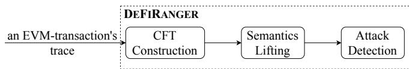

## DeFiRanger: Detecting DeFi Price Manipulation Attacks
- 연도: 2023
- 저자: Siwei Wu, Zhou Yu, Dabao Wang, Yajin Zhou, Lei Wu, Haoyu Wang, Xingliang Yuan
- 저널/컨퍼런스: IEEE Transactions on Dependable and Secure Computing

## 논문 개요
원시 EVM 트랜잭션에서 토큰 이동을 추출하고, 이를 `Trade`, `Deposit`, `Borrow` 같은 고수준 DeFi 행위로 복원한 뒤, 사전에 정의한 행위 패턴과 비교해 두 종류의 가격 조작 공격을 탐지하는 시스템

### Contribution
- 2 종류의 PMA 정의 및 탐지 방법 제안
- DeFi 의미를 체계적으로 정의하고 자동 복원
- 실제 시스템 구현과 zero-day 탐지
- 41개 사건을 분석해 PMA를 유발한 취약점 원인을 `Access control`, `Design compatibility`, `Slippage check`, `Price dependency`로 분류함

## 연구 배경
- DeFi 생태계가 빠르게 성장하면서 DEX, lending 등 다양한 금융 서비스가 스마트 컨트랙트로 구현되고 있음. 23년 4월 당시 DeFi에 예치된 자산은 약 486억 5천만 달러였고, `프론트러닝`, `pump-and-dump`, `플래시론 공격`, `스마트 컨트랙트의 코드 및 논리 취약점 악용`과 같은 보안 사고도 증가했음
- 기존 스마트 컨트랙트 분석 도구는 주로 reentrancy, integer overflow, access contro과 같은 코드 취약점을 찾음
- PMA는 대개 단일 코드 명령의 오류만으로 설명되지 않음
    <ol><li>DEX에서 특정 토큰을 대량 구매<br>
    <li>해당 토큰의 가격이 올라감<br>
    <li>다른 lending 프로토콜이 그 DEX 가격을 신뢰함<br>
    <li>공격자가 비싸게 평가된 토큰을 담보로 과다 차입함</ol>

- raw transaction에서는 단지 여러 CALL, Transfer 이벤트, 토큰 잔액 변화만 보이기 때문에 기존 도구가 "이 사용자가 DEX에서 토큰 X를 토큰 Y로 교환했고, 그 결과를 이용해 lending에서 과다 차입했다"라는 것을 탐지하기 어려움
- 논문에서는 이를 원시 블록체인 트랜잭션과 DeFi 금융 행위 사이의 semantic gap이라고 칭함

## 논문에서 대상으로 하는 PMA
- 저자들은 DEX와 lending 중심으로 2종류의 PMA를 탐지하려고 함
<br>

### Type 1: 피해 컨트랙트에 원치 않는 거래를 시키는 공격
- 공격자는 먼저 DEX에 특정 토큰을 대량 구매해 가격을 높임
- 이후 피해 DeFi 컨트랙트의 취약한 인터페이스를 호출하여, 피해 컨트랙트가 이미 비싸진 토큰을 원치 않는 가격에 구매하기 만듦
- 마지막으로 공격자는 보유한 토큰을 비싸게 매도해 이익을 얻음
- 피해 컨트랙트가 비싼 가격으로 토큰을 구매하면서 발생한 손실이 공격자의 이익으로 이전됨

### Type 2: 조작된 가격을 다른 프로토콜이 사용하게 하는 공격
- 일부 lending은 담보 가치를 계산하기 위해 DEX의 실시간 가격이나 reserve를 사용함
- 공격자는 DEX에서 대규모 거래를 수행하여 특정 토큰의 가격을 일시적으로 높인 다음, 조작된 가격을 신뢰하는 lending에 그 토큰을 담보로 예치함
- 그 결과 정상적인 경우보다 더 많은 자산을 빌릴 수 있음
- 논문에서는 이 유형을 `Price Oracle Manipulation Attack`이라고 부름

### 해결해야 하는 핵심 문제
- PMA는 여러 스마트 컨트랙트 호출과 토큰 이동으로 구성됨. 그러나 블록체인에서 직접 관찰할 수 있는 정보는 `외부 및 내부 컨트랙트 호출`, `함수 인자`, `이벤트 로그`, `Native token 이동`, `ERC20 Transfer 이벤트`임
- 이 정보들로 사용자가 DEX에서 거래했는지, 프로토콜에 자산을 예치했는지, 담보를 이요해 자산을 빌렸는지, LP token을 발행하거나 소각했는지 바로 알 수 없음
- PMA는 대부분 거래, 예치, 차입 등 여러 금융 행위가 결합되어 있기 때문에, 공격을 탐지하기 위해서는 raw level transaction을 먼저 고수준 DeFi action으로 복원해야 됨

## 제안하는 방법 - DeFiRanger
<p align="center">
 
</p>

<p align="center">
 
</p>

### 요약
- call trace와 이벤트로 `Cash Flow Tree` 만듦
- DeFi action을 2단계로 나눔
    <ol><li> 기본 DeFi 행위 - raw transaction에서 비교적 직접 식별할 수 있는 행위(Token Transfer, Token Minting, Token Burning)</li>
    <li>고수준 DeFi 행위 - 기본 행위 여러 개를 조합하여 복원하는 금융 행위(Trade, Deposit, Withdrawal, Borrowing, Repayment)</li></ol>
- raw transaction에서 기본 행위를 먼저 식별하고, 여러 기본 행위 간의 관계를 분석해 고수준 DeFi 행위로 끌어 올림 (`semantic lifting`이라 표현)
- 수익성이 있는 `hoard-and-dump` 구조를 찾고 8개의 공격 패턴을 적용함

### Cash Flow Tree
- `input`: atomic transaction에 대한 invocation trace
- trace에는 2가지 정보가 있음
    1. 함수 호출 Iv=⟨caller, context, value, sig, args⟩
    2. 이벤트 Ev=⟨context, sig, args⟩
- CFT 노드 (3종류)
    - `Invocation node`: 함수 호출을 나타냄
        - `루트 노드`: EOA가 발생시킨 최초 외부 트랜잭션
        - `중간 노드`: 그 안에서 발생한 내부 컨트랙트 호출
        - `자식 관계`: 실제 호출 관계
        ```    
        EOA → Attacker Contract
            ├─ FlashLoan Provider
            ├─ DEX
            │    └─ Token Contract
            └─ Lending Protocol
        ```
    - `Event node`: 특정 함수 호출 안에서 발생한 이벤트를 나타냄
        - 이벤트 노트는 이벤트를 발생시킨 invocation node의 자식에 배치됨
    - `Basic node`: Transfer, Minting, Burning에 대한 기본 행위를 나타냄
    - Event node, Basic node는 모두 leaf node임. 이후 semantic lifting 수행하면 Advanced node도 추가됨

### Semantic lifting
- basic action을 advanced action으로 변환하는 단계
- CFT를 후위 순회(post-order traversal)함. 가장 안쪽 호출부터 처리한 후 바깐 호출로 올라옴

### 공격 탐지
- 고수준으로 복원한 행위 중에 Deposit과 Borrow가 따로 복원되어 있으면, 이 둘이 같은 담보대출 과정인지 확인해 Collateral Borrowing이라는 복합 행위로 묶음
```
    1. Deposit에 담보 토큰이 하나인가?
    2. Deposit의 share holder와 Borrow의 debtor가 같은가?
    3. Borrow 실행 과정에서 담보가 예치된 컨트랙트의 상태를 조회했는가?
```
- 상위 조건을 만족하면 Cb=⟨De,{Bo}⟩로 만듦
- 논문에서는 hoard-and-dump 후보를 찾아 탐지하고자 함
    - 자산을 확보(hoard)하여 중간 조작 또는 피해 행위를 수행한 뒤, 더 높은 가치로 처분(dump)하는 행위
- 이에 전체 트랜잭션에서 5가지 행위 조합을 검사함
    ```
    1. 거래로 토큰을 산 뒤 다른 거래로 판매
    2. 거래로 얻은 토큰을 담보로 사용해 차입
    3. 차입으로 받은 토큰을 거래해 수익화
    4. 예치 후 더 유리한 비율로 인출
    5. 예치로 받은 share를 담보로 사용해 차입
    ```
- 단순한 거래라면, 
    ```
    100 ETH를 써서 TOKEN 1,000개 획득
    TOKEN 1,000개를 팔아 120 ETH 획득
    ```
    에서 100 ETH<120 ETH 이므로 hoard-and-dump 후보가 됨
- 근데 실제로는 여러 토큰이 섞인 흐름이므로, BackTrack으로 최초 비용 토큰과 수량을 찾고, 최종 수익 토큰과 수량을 찾아(Trace) 동일한 토큰 단위로 비교함 BackTrack(cost)<Trace(revenue)

#### Type 1 탐지 패턴
| 패턴              | 필요한 행위 흐름                                     | 구체적인 탐지 조건                                                                                                                                         | 쉽게 설명하면                                                                                   |
| --------------- | --------------------------------------------- | -------------------------------------------------------------------------------------------------------------------------------------------------- | ----------------------------------------------------------------------------------------- |
| **Pattern I**   | 공격자의 선행 거래 → 다른 주체의 중간 거래 → 공격자의 후행 거래        | 첫 번째 거래에서 확보한 토큰을 마지막 거래에서 더 높은 가치로 처분해야 합니다. 중간 거래자는 마지막 거래자와 달라야 합니다. 중간 거래와 마지막 거래는 같은 DEX 풀에서 일어나야 하며, 중간 거래에서 받은 토큰이 공격자가 마지막에 판매한 토큰이어야 합니다. | 공격자가 토큰을 미리 산 뒤 피해 컨트랙트가 같은 토큰을 비싸게 사도록 만들고, 공격자가 그 토큰을 피해자가 사용한 풀에 되파는 구조입니다.            |
| **Pattern II**  | 공격자의 선행 거래 → 풀에서 발생한 토큰 전송·발행·소각 → 공격자의 후행 거래 | 선행 거래와 후행 거래가 수익 관계여야 하며 같은 DEX 풀에서 발생해야 합니다. 두 거래 사이에 해당 DEX 풀이 후행 거래의 입력 토큰을 직접 전송하거나 소각하는 행위가 있어야 합니다.                                          | 공격자가 토큰을 미리 확보한 뒤, 취약한 burn·transfer 기능 등으로 DEX 풀의 토큰 잔액을 변화시키고, 가격이 변한 뒤 토큰을 판매하는 구조입니다. |
| **Pattern III** | 공격자의 선행 거래 → 다른 주체의 예치 → 공격자의 후행 거래           | 선행 거래에서 확보한 토큰을 후행 거래에서 이익을 남기며 처분해야 합니다. 두 거래와 중간 예치는 모두 같은 DEX 풀과 관련되어야 합니다. 중간 예치로 받은 LP 토큰이나 지분 토큰의 보유자는 선행 거래자와 달라야 합니다.                      | 공격자가 풀 가격을 먼저 움직이고, 피해 컨트랙트가 불리한 상태에서 같은 풀에 유동성을 공급하게 한 다음, 공격자가 반대 거래로 이익을 얻는 구조입니다.     |
| **Pattern IV**  | 담보 차입 → 다른 주체의 중간 거래 → 공격자의 후행 거래             | 담보 차입을 통해 얻은 자산이 마지막 거래에서 더 높은 가치로 수익화되어야 합니다. 중간 거래자는 마지막 거래자와 달라야 합니다. 중간 거래와 마지막 거래는 같은 풀에서 일어나며, 중간 거래에서 받은 토큰이 마지막 거래의 입력 토큰이어야 합니다.          | 공격자가 담보대출 과정에서 자산을 확보하고, 다른 주체의 거래가 가격을 움직이게 한 뒤, 확보한 자산을 같은 풀에서 유리하게 판매하는 구조입니다.         |

#### Type 2 패턴
| 패턴               | 필요한 행위 흐름                                   | 구체적인 탐지 조건                                                                                                                                                         | 쉽게 설명하면                                                                                                                   |
| ---------------- | ------------------------------------------- | ------------------------------------------------------------------------------------------------------------------------------------------------------------------ | ------------------------------------------------------------------------------------------------------------------------- |
| **Pattern V**    | DEX 거래 → 해당 토큰을 이용한 담보 차입                   | DEX 거래로 얻은 토큰이나 변화시킨 가격을 이용한 담보 차입에서 공격자에게 이익이 발생해야 합니다. 담보 차입에 포함된 모든 차입 과정에서 앞서 거래한 DEX 풀의 상태 또는 잔액을 조회해야 합니다.                                                   | 공격자가 DEX에서 토큰 가격을 올린 뒤 그 토큰을 담보로 넣습니다. Lending 프로토콜이 조작된 DEX 값을 사용하여 담보를 과대평가하고 정상보다 많은 자산을 빌려주는 구조입니다.                   |
| **Pattern VI**   | 프로토콜에 예치 → 외부 DEX 거래 → 프로토콜에서 인출            | 예치보다 인출의 가치가 커야 합니다. 가격을 움직인 DEX와 자산을 인출한 프로토콜은 서로 달라야 합니다. DEX 거래자와 지분 토큰 보유자가 같아야 합니다. 인출 과정에서 앞서 거래한 DEX 풀의 상태를 조회해야 합니다.                                       | 공격자가 vault에 먼저 예치한 뒤 외부 DEX 가격을 조작합니다. Vault가 조작된 가격을 사용해 지분 가치를 잘못 계산하고, 공격자에게 예치한 것보다 많은 자산을 지급하는 구조입니다.                |
| **Pattern VII**  | 최초 예치 → 중간 예치 또는 인출 → 최종 인출                 | 최초 예치보다 최종 인출의 가치가 커야 합니다. 중간 행위가 일어난 프로토콜과 최종 인출 프로토콜은 서로 달라야 합니다. 중간 행위와 최종 인출의 지분 토큰 보유자가 같아야 합니다. 최종 인출 과정에서 중간 행위와 관련된 LP 토큰이나 지분 토큰의 총공급량을 조회해야 합니다.         | 공격자가 외부 LP 토큰이나 지분 토큰의 공급량을 변화시킨 뒤, 그 총공급량을 평가에 사용하는 다른 프로토콜에서 과도한 자산을 인출하는 구조입니다.                                        |
| **Pattern VIII** | DEX에 유동성 예치 → DEX 거래로 상태 변화 → LP 토큰을 담보로 차입 | DEX 예치로 받은 LP 토큰을 담보로 사용한 차입에서 이익이 발생해야 합니다. 가격을 변화시킨 DEX와 LP 토큰을 담보로 받은 lending 프로토콜은 서로 달라야 합니다. DEX 거래자와 차입자가 같아야 합니다. 모든 차입 과정에서 가격을 변화시킨 DEX 풀의 상태를 조회해야 합니다. | 공격자가 DEX에 유동성을 넣어 LP 토큰을 받은 뒤, 해당 DEX의 reserve나 가격을 조작합니다. Lending 프로토콜이 그 상태로 LP 토큰을 과대평가하고, 공격자가 정상보다 많은 자산을 빌리는 구조입니다. |

#### 패턴 8개 차이 간단히 비교
| 패턴           | 공격자가 변화시키거나 이용하는 대상      | 피해 프로토콜의 중간 행위     | 공격자의 최종 이익         |
| ------------ | ------------------------ | ------------------ | ------------------ |
| Pattern I    | DEX 거래 가격                | 피해자의 토큰 거래         | 같은 DEX에 토큰을 비싸게 판매 |
| Pattern II   | DEX 풀의 토큰 잔액이나 공급        | 풀의 토큰 전송·발행·소각     | 변화된 가격으로 토큰 판매     |
| Pattern III  | DEX 거래 가격                | 피해자의 유동성 예치        | 같은 DEX에서 반대 거래     |
| Pattern IV   | 담보 차입으로 확보한 자산           | 다른 주체의 DEX 거래      | 차입 자산을 유리하게 거래     |
| Pattern V    | 담보 토큰의 DEX 가격            | Lending의 담보 평가와 차입 | 정상보다 많은 자산 차입      |
| Pattern VI   | Vault가 참고하는 외부 DEX 가격    | Vault의 인출량 계산      | 예치보다 많은 자산 인출      |
| Pattern VII  | LP·지분 토큰의 총공급량           | 다른 프로토콜의 지분가 계산    | 과도한 자산 인출          |
| Pattern VIII | LP 토큰의 기반 DEX reserve·가격 | Lending의 LP 담보 평가  | 정상보다 많은 자산 차입      |

## 실험 설계 및 평가
- 논문에서는 크게 2가지를 검증함
```
1. CTF와 semantic lifting이 실제 DeFi 행위를 정확히 복원하는가?
2. 복원된 행위와 공격 패턴을 이용해 실제 PMA를 탐지할 수 있는가?
+ 기존 스마트 컨트랙트 분석 도구, 수익 기반 탐지 도구와의 차이를 논함
```
- 구현체 정보: Rust, 6,140줄

### 평가 구성
| 평가 항목        | 검증하려는 주장                                                   | 평가 방식                                        |
| ------------ | ---------------------------------------------------------- | -------------------------------------------- |
| DeFi 의미 복원   | Transfer·Mint·Burn에서 Trade·Deposit·Borrow 등을 정확히 복원할 수 있는가 | 1시간 동안의 Ethereum 트랜잭션을 사람이 전수 분석해 정답 데이터셋 생성 |
| 실환경 탐지       | 알려지지 않은 실제 공격도 발견할 수 있는가                                   | BlockSec과 함께 실시간 운영                          |
| 대규모 backtest | 수천만 건의 과거 트랜잭션에서 공격을 얼마나 정확히 골라내는가                         | 알려진 사고 26건이 발생한 날짜 전체를 재분석                   |
| 오탐 분석        | 어떤 정상 행위가 공격 패턴과 혼동되는가                                     | 탐지 결과를 수작업으로 조사                              |
| 기존 도구 비교     | 기존 코드 취약점·수익 기반 도구와 무엇이 다른가                                | 정성적 비교 및 선행 연구 결과 인용                         |

### 1. DeFi 의미 복원 평가
- 저자들은 당시 고수준 DeFi 행위에 대한 공개 ground truth가 없어, 특정 시간대의 트랜잭션을 사람이 직접 읽고, 각 트랜잭션에 어떤 advanced action이 존재하는지 정답을 만듦

#### 데이터 수집 범위

| 항목                      | 내용                           |
| ----------------------- | ---------------------------- |
| 체인                      | Ethereum                     |
| 시간                      | 2022년 10월 7일 08:00–09:00 UTC |
| 시간 범위                   | 1시간                          |
| 트랜잭션 수                  | 15,272개                      |
| 사람이 확인한 advanced action | 8,117개                       |

#### DeFiRanger의 복원 결과
| 결과                       |    개수 | 의미                                      |
| ------------------------ | ----: | --------------------------------------- |
| 시스템이 생성한 advanced action | 7,841 | DeFiRanger가 Trade·Deposit 등으로 복원한 전체 결과 |
| True Positive            | 7,808 | 실제 행위와 일치한 결과                           |
| False Positive           |    33 | 실제로는 없는데 잘못 생성한 행위                      |
| False Negative           |   309 | 실제로 존재하지만 복원하지 못한 행위                    |
| Precision                | 0.996 | 시스템이 복원했다고 한 행위 중 맞은 비율                 |
| TPR, 즉 Recall            | 0.962 | 실제 존재하는 행위 중 복원한 비율                     |

> DeFiRanger가 “이것은 Trade나 Deposit이다”라고 출력한 결과는 거의 맞았지만, 비표준 프로토콜의 일부 행위는 놓쳤음. Precision이 매우 높은 이유는 잘못 만들어진 행위가 33개로 적었기 때문. 반면 309개의 행위를 놓쳤으므로, 복원 결과의 정확성보다 지원하지 못한 구현으로 인한 누락이 더 큰 문제였음

#### semantic lifiting 오류 원인
- 저자들은 33개 오탐과 309개 미탐을 3 종류로 분류함

| 원인 | False Negative | False Positive | 설명 |
| --------- | -------------: | -------------: | ----------- |
| 잘 알려지지 않은 DeFi 앱의 외부 정보 부족 |  295 | 6 | 내부 장부를 쓰는 함수에 대한 수동 decoder 정보가 없어 숨겨진 basic action을 복원하지 못함 |
| DeFi 앱이 아닌 개인용 컨트랙트 | 0 |  6 | 우연히 토큰 흐름이 Trade·Deposit 조합 규칙과 일치함  |
| 예상하지 못한 비표준 구현  |  14 |  21 | 논문이 정의한 advanced action 구조와 다른 구현  |


## Challenge
- 하나의 복잡한 DeFi 트랜잭션에는 수많은 토큰 이동이 발생하기 때문에, Trade, Deposit 이런 묶음을 잘못 판단하면 가짜 고수준 행위가 생성됨
- 일부 DeFi 프로토콜은 실제 토큰 전송 이벤트 없이 내부 ledger만 수정하기 때문에 이벤트 로그만 분석하면 행위 일부가 누락됨
- Router, aggregator, yield farming contract 등 중간 컨트랙트를 거치는 자산 이동이 많아 이를 무조건 하나로 합치면 중첩된 DeFi 행위를 놓치고, 합치지 않으면 같은 거래를 여러 개의 별도 행위로 잘못 인식할 수 있음

## 생각 정리
- DeFiRanger도 이벤트에 대해서 Swap이면 호출 구조상 어떤 파라미터를 뽑아서 조회해야 하는지 사전에 프로토콜 별로 정의해서 사용하고 있음. 근데 논문에서 구체적으로 어떤 프로토콜과 어떤 함수 호출에 대해서 등록한건지 안알려줌
- 