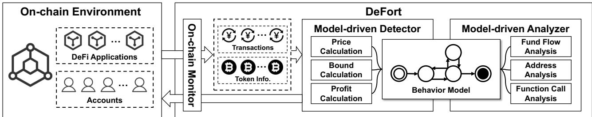
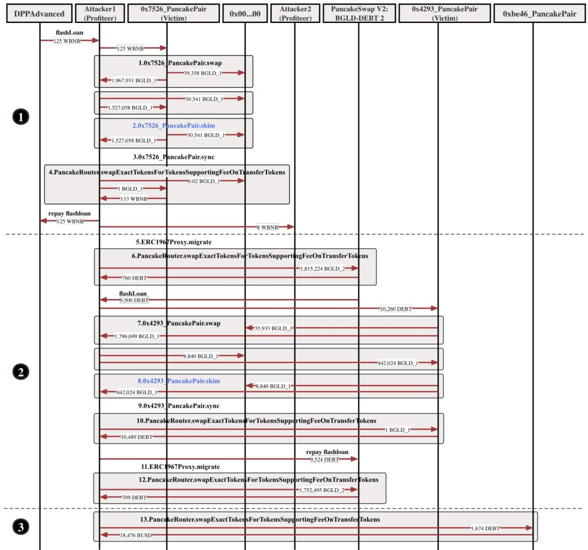
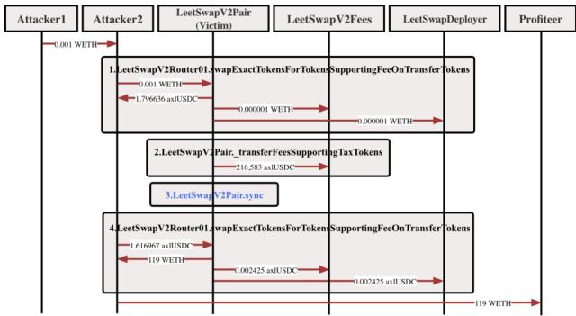

# DeFort: Automatic Detection and Analysis of Price Manipulation Attacks in DeFi Applications
- 연도: 2024
- 저자: Maoyi Xie, Ming Hu, Ziqiao Kong, Cen Zhang, Yebo Feng, Haijun Wang, Yue Xue, Hao Zhang, Ye Liu, Yang Liu
- 저널/컨퍼런스: Proceedings of the 33rd ACM SIGSOFT International Symposium on Software Testing and Analysis (ISSTA '24)
- DOI: 10.1145/3650212.3652137

## 논문 개요
특정 DeFi 애플리케이션과 관련된 pool·pair의 토큰 가격을 지속적으로 관찰하고, 현재 가격이 해당 pool의 역사적 정상 범위를 벗어난 뒤 관련 주소 집합에서 양의 이익이 발견되면 가격 조작 공격으로 탐지하는 시스템이다. 탐지 후에는 트랜잭션 실행 trace와 Transfer·Swap을 이용하여 관련 주소, 자금 흐름, 함수 호출 순서를 분석한다.

DeFort의 핵심 추상화는 공격별 고정 패턴이 아니라 다음 두 조건이다.

```text
비정상적인 토큰 가격 변동
+
비정상 가격 이후 관련 주소의 이익
=
가격 조작 공격 탐지
```

여기서 `model-driven`은 학습 모델이 아니라 `Start`, `Normal`, `Abnormal`, `Price Read`, `Profit` 상태를 가지는 규칙 기반 automaton을 뜻한다.

### Contribution
- 온체인 가격 조작 공격을 자동으로 탐지하고 분석하는 DeFort 프레임워크 제안
- 공격 원인이 달라도 공통으로 적용할 수 있는 가격 조작 행동 상태모델 제안
- 여러 프로토콜의 가격 계산, 역사적 정상 범위 계산, 주소별 이익 계산 전략을 상태모델에 결합
- 알려진 PMA 54건과 정상으로 간주한 435개 앱을 이용한 평가
- 5개 체인에서 441개 앱을 두 달 동안 모니터링하여 5개 사건을 탐지했다고 보고

> 이 논문에서 `탐지 성공`은 사건에 대해 가격 이상과 이익 조건이 성립했다는 뜻이다. 왜곡값, 공격자, 피해자, 이익액, 손실액을 각각 정확하게 복원했다는 뜻은 아니다.

<br>

## 연구 배경

### 저자들이 분류한 PMA 원인
1. **보호되지 않은 거래 메커니즘**
   - 과도한 slippage와 거래 순서 등을 이용하는 sandwich·front-running
2. **취약한 컨트랙트 구현**
   - 잘못된 가격 계산 함수나 business logic flaw
3. **신뢰할 수 없는 외부 구성요소**
   - 조작 가능한 oracle이나 제3자 가격 정보

Flash loan은 담보 없이 같은 트랜잭션 안에서 상환하는 조건으로 대규모 자산을 빌릴 수 있기 때문에 기존의 가격 및 거래 메커니즘 문제를 크게 증폭할 수 있다고 설명한다.

### 기존 연구의 한계에 대한 논문의 주장
- 정적 분석·symbolic execution은 실제 공격 발생 여부보다 코드상 취약 가능성을 찾기 때문에 동적 실행과 외부 구성요소를 충분히 반영하기 어렵다.
- 기존 behavior 기반 탐지는 특정 공격 패턴을 사용하기 때문에 여러 주소와 컨트랙트가 결합된 새로운 공격에 일반화하기 어렵다.
- 기존 도구는 탐지 이후 공격 과정, 관련 함수, 주소, 자금 흐름을 자동으로 설명하는 능력이 부족하다.

### 저자들이 제시한 세 가지 Challenge
| Challenge | 논문의 문제의식 |
| --- | --- |
| Scalability | 공격별 규칙을 계속 추가하는 방식은 서로 다른 DeFi business logic에 적용하기 어려움 |
| On-chain Monitoring | 실제 체인에서 빠르게 공격을 탐지하고 차단에 활용할 수 있어야 함 |
| Automatic Analysis | 탐지 여부뿐 아니라 공격 과정과 관련 함수·주소·자금 흐름을 자동 분석해야 함 |

<br>

## 논문에서 대상으로 하는 PMA

### PMA 정의
논문은 암호화폐 가격 조작 공격을 다음과 같이 정의한다.

> 공격자가 여러 기만적 전략으로 암호화폐 가격을 인위적으로 상승 또는 하락시키고, 이를 이용해 과도한 이익을 얻는 공격

논문이 예로 드는 방법은 다음과 같다.

- flash loan을 이용한 순간 가격 변동
- oracle 조작
- pump and dump
- front-running
- sandwich

실환경 평가에는 `setDirectPrice()`로 가격을 설정한 뒤 자금을 가져간 MagnateFi rug pull도 PMA로 포함되어 있어, 논문이 실제로 적용한 PMA 범위는 일반적인 oracle·AMM 조작보다 넓다.

### 탐지에 사용하는 공통 행동 가정
논문은 모든 성공한 PMA가 다음 두 특성을 공유한다고 가정한다.

1. 대상 토큰 가격에 비정상적인 변동이 발생함
2. 비정상 가격 이후 일부 주소가 이익을 얻음

이 가정을 사용하면 flash loan, pump-and-dump, oracle 조작처럼 구체적인 과정이 달라도 개별 공격 패턴을 만들지 않고 탐지할 수 있다고 주장한다.

> 이 가정은 논문의 핵심 탐지 가설이다. `가격 이상`과 `관련 주소의 이익` 사이의 데이터 의존성이나 공동통제까지 탐지 조건으로 요구하지는 않는다.

<br>

## 제안하는 방법 - DeFort

<p align="center">
 
</p>

### 전체 구조
| 구성요소 | 입력 및 역할 | 주요 출력 |
| --- | --- | --- |
| On-chain Monitor | RPC로 대상 앱·주소의 트랜잭션과 토큰 정보를 수집 | 거래, 토큰 상태, 관련 주소 정보 |
| Model-driven Detector | 현재 가격, 역사적 정상 범위, 관련 주소 이익을 계산 | `Normal / Abnormal / Price Read / Profit` 상태와 공격 경보 |
| Model-driven Analyzer | 상태 전이, 관련 거래, call trace, Transfer·Swap을 분석 | 공격자·피해자 후보, 자금 흐름, 관련 함수와 호출 순서 |

### 사전 수집 정보와 모니터링 범위
- 저자들은 대상 DeFi 애플리케이션의 보유 토큰과 컨트랙트 생성자 등을 수동으로 수집하여 저장한다.
- 관련 pool·pair 집합과 토큰 집합을 감시 대상으로 사용한다.
- Alchemy, Infura, QuickNode 같은 제3자 RPC 또는 자체 노드로 트랜잭션을 얻을 수 있으며, 구현에서는 제3자 RPC를 사용한다.
- API 요청량을 줄이기 위해 앱별 거래량·활성도와 체인별 block confirmation 시간을 고려해 모니터링 빈도를 다르게 설정한다.

논문은 대상 앱에서 관련 pool·pair와 토큰을 확장하는 전체 규칙, 수동 설정량, 모니터링 빈도 값을 공개하지 않는다.

### 가격 조작 행동 상태모델

<p align="center">
 
</p>

| 상태 | 논문에서의 의미 | 상태 전이 기준 |
| --- | --- | --- |
| Start | 탐지 시작 | 모니터링 시작 후 Normal로 이동 |
| Normal | 대상 앱의 모든 관련 토큰 가격이 정상 범위 안에 있음 | 하나 이상의 pool·pair 가격이 범위를 벗어나면 Abnormal |
| Abnormal | 하나 이상의 관련 토큰 가격이 정상 범위를 벗어남 | 가격을 읽으면 일시적으로 Price Read, 이익이 발견되면 Profit, 가격 복귀 후 이익이 없으면 Normal |
| Price Read | 비정상 가격이 읽힌 것을 관찰 | 관련 주소를 집합에 추가한 뒤 다시 Abnormal로 복귀 |
| Profit | 하나 이상의 관련 주소 또는 주소 집합이 양의 이익을 가짐 | 이 상태에 도달하면 PMA 경보 |

`Price Read`는 transient state이다. 논문의 최종 탐지 설명은 Abnormal 상태에서 PDM이 참이면 Profit으로 이동한다고 정의하므로, 가격 읽기 상태를 반드시 거쳐야 공격으로 탐지되는 것은 아니다.

### 주요 기호
| 기호 | 의미 |
| --- | --- |
| `D` | 감시 대상 DeFi 애플리케이션 집합 |
| `X` | 대상 앱과 관련된 pool·pair 집합 |
| `Xa` | 관련 토큰 가격이 비정상인 pool·pair 부분집합 |
| `Xn` | 관련 토큰 가격이 정상인 pool·pair 부분집합 |
| `T` | 관련 토큰 집합 |
| `Th` | `(과거 가격 p, 관측 시각 t')` 목록 |
| `Sa` | 관련 주소 집합. 절에 따라 비정상 가격을 읽은 주소 또는 대상 앱과 거래한 주소로 설명되어 정의가 일관되지 않음 |
| `PCM` | 현재 토큰 교환비 계산 메커니즘 |
| `HCM` | 과거 가격 가중평균 계산 메커니즘 |
| `BCM` | 현재 가격이 정상 범위인지 판단하는 메커니즘 |
| `PDM` | 관련 주소의 이익을 계산하여 공격 여부를 확인하는 메커니즘 |

### 1. 현재 가격 계산 - PCM
`PCM(P, Tk1, Tk2, t)`는 시각 `t`에 pool·pair `P`에서 `Tk1`의 `Tk2` 대비 교환비를 계산한다.

서로 다른 DeFi 프로토콜은 가격을 계산하고 저장하는 방식이 다르기 때문에 DeFort는 여러 가격 계산 전략을 결합한다.

| 전략 | 논문의 설명 |
| --- | --- |
| 주류 프로토콜 템플릿 | Uniswap V2, Uniswap V3, Curve 등의 가격 계산 방식을 미리 통합하고 대상 바이트코드를 템플릿과 매칭하여 전략 선택 |
| 가격 함수 signature library | 주류 프로토콜이 아니면 `getLatestPrice()`, `updatePrice()`, `getUnderlyingPrice()` 같은 가능한 가격 함수 signature를 바이트코드에서 매칭 |
| 사용자 지정 계산 | 자동으로 찾기 어려우면 감사자가 직접 가격 계산 함수를 배포하거나 계산 전략을 지정 |

논문은 프로토콜 템플릿과 signature library의 전체 내용, 바이트코드 매칭 알고리즘, proxy·fork·비표준 구현 처리, 함수 실행 및 반환값 수집 방법을 구체적으로 공개하지 않는다.

### 2. 역사적 기준 가격 - HCM
DeFort는 특정 과거 시점 하나와 비교하지 않는다. 모니터링하면서 축적한 여러 과거 가격을 최근 값일수록 크게 반영하는 가중평균과 비교한다.

$$
HCM(x,T_h,t)=
\frac{\sum_{(p,t')\in T_h}\frac{1}{\sqrt{t-t'+\beta}}p}
{\sum_{(p,t')\in T_h}\frac{1}{\sqrt{t-t'+\beta}}}
$$

- `p`: 과거에 관찰한 가격
- `t'`: 해당 가격의 관찰 시각
- `t`: 현재 시각
- `β > 0`: 시간에 따른 가중치 영향을 조절하는 hyperparameter
- 최근 가격일수록 더 높은 가중치를 가짐

저자들은 직전 가격 하나가 아니라 여러 과거 가격을 사용하는 이유를 가격을 서서히 올리는 조작도 탐지하기 위해서라고 설명한다.

### 3. 정상 가격 범위 - BCM
과거 가격의 가중 변동을 이용해 정상 가격 범위 `B`를 계산한다.

$$
B(\alpha,T_h,t)
=1+\alpha
\frac{
\sqrt{\sum_{(p,t')\in T_h}
\frac{(p-HCM(T_h,t))^2}{\sqrt{t-t'+\beta}}}}
{
\sum_{(p,t')\in T_h}
\frac{1}{\sqrt{t-t'+\beta}}HCM(T_h,t)
}
$$

현재 가격과 역사적 기준 가격의 비율이 아래 범위 안에 있으면 정상으로 판단한다.

$$
\frac{1}{B(\alpha,T_h,t)}
\leq
\frac{PCM(x,Tk_1,Tk_2,t)}{HCM(x,Tk_1,Tk_2,t)}
\leq
B(\alpha,T_h,t)
$$

관련 pool·pair 중 하나라도 이 조건을 벗어나면 Abnormal 상태로 이동한다. `α`가 클수록 허용하는 정상 변동 폭도 커진다.

논문에 없는 세부사항은 다음과 같다.

- `Th`가 포함하는 과거 시간 window
- per-block, per-transaction 등 가격 sampling 주기
- 초기화 방법과 최소 표본 수
- 현재 관측값을 이상 판정 전에 `Th`에 포함하는지 여부
- `α`, `β`의 실제 값과 선정 근거
- 토큰·pool·체인별 parameter 차이
- 이상 상태에서 역사 가격 목록을 계속 갱신하는지 여부

따라서 논문만으로는 동일한 정상 범위를 재현할 수 없다. 또한 기준이 독립적인 외부 정상가격이 아니라 해당 pool 자신의 과거 가격이므로, 과거가 이미 왜곡됐거나 서서히 오염될 때의 안전성도 검증되지 않았다.

### 4. Price Read
- 비정상 가격이 발생한 동안 가격 읽기 operation을 모니터링한다.
- 관련 주소를 비정상 관련 주소 집합 `Sa`에 추가한 뒤 다시 Abnormal 상태로 돌아간다.
- 논문은 일반적으로 공격자가 비정상 가격을 이용할 때 피해 DeFi 앱이 해당 가격을 읽고 토큰을 전송한다고 설명한다.

그러나 가격 함수 호출의 존재와 `반환된 값 → 후속 계산 → 정산` 데이터 의존성은 구분된다. 논문은 Price Read의 호출 또는 관련 operation은 설명하지만, 반환값이 어느 의사결정에 실제로 사용됐는지 일반적으로 추적하는 규칙은 제시하지 않는다.

#### Atomic transaction 내부의 일시적 왜곡과 원복

DeFort를 `직전 블록과 직후 블록의 최종 가격만 비교하는 도구`로 해석하는 것은 정확하지 않다. 정상 기준은 직전 한 블록이 아니라 여러 historical price의 HCM으로 구성하고, 분석 단계에서 transaction execution trace, Transfer·Swap, 함수 호출 순서를 사용한다.

그러나 다음과 같은 flash-loan 공격을 어떻게 확실히 관측하는지는 별도의 문제다.

```text
tx 시작: price = 100
→ flash loan과 swap으로 price = 500
→ victim이 500을 읽고 borrow/withdraw 수행
→ reverse swap으로 price = 101
→ tx 종료
```

이 사례를 잡으려면 트랜잭션 종료 state가 아니라 `price = 500`이던 중간 execution point의 PCM 또는 가격 함수 반환값을 관측해야 한다. 논문은 execution trace를 사용한다고 밝히고 Discover 사례에서 `getprice()` 반환값이 trace에 없어 놓쳤다고 설명하므로, 최종 state만 보는 설계는 아니다. 반면 논문은 다음을 구체적으로 명세하지 않는다.

- PCM을 transaction 내부의 어느 call·state snapshot에서 평가하는지
- internal call별 storage version과 중간 reserve를 replay하는지
- 가격 반환값을 후속 borrow·withdraw·mint·redeem 수량과 연결하는지
- 모니터링 주기 사이에 발생하고 원복된 transient state를 어떻게 보존하는지

따라서 `atomic tx를 trace로 본다`는 점과 `tx 내부에서 조작된 정확한 값의 생성·소비·원복을 재구성한다`는 주장은 구분해야 한다. 알려진 atomic PMA를 여러 건 탐지했다는 사건 단위 결과는 존재하지만, 이 중간 값 복원 메커니즘의 완전성은 논문만으로 재현·검증할 수 없다.

### 5. 주소별·토큰별 이익 계산 - PDM
주소 `addr`가 pool·pair `x`에 넣은 토큰과 받은 토큰의 차이로 토큰별 이익을 정의한다.

$$
Profit(x,addr,Tk)=Out(x,addr,Tk)-In(x,addr,Tk)
$$

- `In`: 주소가 pool·pair에 넣은 특정 토큰의 총량
- `Out`: 주소가 pool·pair에서 받은 특정 토큰의 총량

공격이 여러 토큰을 포함하면 USDT 같은 일반 등가 토큰으로 환산한다. 구현 설명에서는 CoinGecko와 CoinMarketCap 같은 제3자 가격 플랫폼에서 탐지 토큰과 USDT의 환율을 얻는다고 한다.

논문의 PDM 조건은 다음과 같다.

$$
\exists A\subset S_a,
\sum_{a\in A}\sum_{i=1}^{|T|}
PCM(x,Tk_i,Tk,t)\times Profit(x,a,Tk_i)>0
$$

즉, 관련 주소 집합 `Sa`의 어떤 부분집합 `A`가 여러 토큰을 공통 단위로 환산했을 때 양의 이익을 가지면 Profit 상태로 이동한다.

### 6. 관련 주소 확장
가격 이상이 발견되면 다음 주소를 수집하고 이익을 계산한다.

1. 가격 이상을 발생시킨 트랜잭션의 계정
2. Abnormal 상태 이후 대상 DeFi 앱과 상호작용한 모든 계정
3. 비정상 앱 또는 관련 주소와 상호작용한 EOA와 contract address
4. 잠재적 공격 주소의 과거 거래에서 발견한 자금 출처와 수익 이전 주소

논문은 주소 탐색 시간 범위, 최대 hop, router·pool·token 같은 인프라 주소 처리, 동일 통제자 clustering 규칙을 설명하지 않는다.

### 7. 탐지 이후 자동 분석

#### 주소 분석
| 관측 | 논문의 역할 분류 |
| --- | --- |
| 가격 이상을 발생시킴 | 공격자 |
| 관련 주소 중 이익을 얻음 | 공격자 |
| 가격 이상 거래와 관련되지 않았고 자금을 잃음 | 피해자 |
| 이익도 없고 가격 이상도 발생시키지 않음 | benign으로 필터링 |
| 소액 이익 | 정상 가격 변동일 수 있으므로 필터링 |

피해자는 일반적으로 대상 DeFi 앱의 pool·pair라고 설명한다. 소액 이익 threshold의 값은 공개하지 않는다.

#### 자금 흐름 분석
- 대상 앱의 관련 트랜잭션에서 모든 token transfer 또는 swap operation을 추출한다.
- operation parameter에서 토큰 수량, 출발 주소, 도착 주소를 얻는다.
- 앱·pool·관련 주소 사이의 fund flow를 구성한다.
- potential attacker의 과거 거래를 추적하여 flash loan 등의 자금 출처와 다른 주소로의 수익 이전을 분석한다.

#### 함수 호출 분석
- 가격 이상을 발생시킨 거래의 함수 호출 순서를 추출한다.
- 가격 이상과 관련될 수 있는 함수로 `swap`, `transfer`, `balanceOf` 등을 예로 든다.
- Abnormal 상태의 거래에서 토큰 전송과 관련된 함수들을 추출한다.
- 가격 이상 후보 함수 집합과 이익 획득 후보 함수 집합을 만들고 benign 주소 관련 함수를 필터링한다.
- 중첩 호출 관계를 포함한 호출 sequence를 보존한다.

이 함수들은 취약점의 정확한 root cause가 아니라 공격과 상관관계가 있는 `associated function`으로 출력된다. 논문은 함수 이름 예시를 제시하지만 전체 후보 함수 목록, 이름·selector·실행 효과를 이용한 semantic 식별 규칙은 설명하지 않는다.

<br>

## 실험 설계 및 평가

### Research Questions
| RQ | 평가 질문 |
| --- | --- |
| RQ1 | DeFort가 PMA를 얼마나 정확하게 탐지하는가? |
| RQ2 | 탐지한 PMA의 관련 함수와 공격 행동을 얼마나 효과적으로 분석하는가? |
| RQ3 | 실제 온체인 배포에서 현실의 PMA를 탐지할 수 있는가? |

### 데이터셋
| 데이터셋 | 구성 | 용도 |
| --- | --- | --- |
| D1 | 과거 PMA를 겪은 DeFi 앱·사건 54건 | true positive detection rate/recall 평가 |
| D2 | PMA 취약 가능성이 낮다고 간주한 고가치 DeFi 앱 435개, 1개월 428,523 tx | false positive 평가 |

#### D1 구성
- DeFiTainter에서 사용한 취약 애플리케이션 23개 포함
- DeFiHackLabs가 2022-04-01부터 2023-03-01까지 보고한 128개 incident 수집
- `price manipulation` label 19건을 선택
- 다른 label에도 PMA가 있을 수 있어 나머지 사건을 수동 분석
- 35개 PMA를 찾았고 기존 D1과 중복된 4건을 제외하여 총 54건 구성

D1은 이미 PMA라고 알려진 positive 사건 모음이다. 논문은 각 사건에 대해 어떤 공격 전 정상 거래 구간을 replay했는지, 공격 시점을 모르는 조건에서 실행했는지, 사건별 수동 설정량이 얼마인지 설명하지 않는다.

#### D2 구성
| 항목 | 내용 |
| --- | --- |
| 출처 | DeFiLlama의 고가치·감사된 앱 |
| 앱 수 | 435개 |
| 기간 | 2023-10-09 ~ 2023-11-09 UTC |
| 트랜잭션 | 428,523개 |
| TVL | 2023년 초 기준 약 274억 달러 |

저자들은 높은 TVL과 개발자 관심이 PMA 가능성을 낮춘다고 가정하고, 보안 회사 데이터베이스와 공개 공격 보고서에서 해당 기간의 사고가 없음을 확인하여 D2를 정상으로 취급했다.

### 구현 정보
| 항목 | 내용 |
| --- | --- |
| 구현 규모 | 약 4,500 LOC |
| 지원 체인 | Ethereum, BSC, Fantom, Polygon, Base |
| RPC | QuickNode |
| 실험 환경 | Ubuntu 20.04, Xeon W-2235 3.80GHz, 32GB memory |
| 공개 범위 | DeFort는 MetaScout에 통합되었고 논문은 GitHub에 데이터셋을 공개했다고 명시함. 구현 소스 공개는 명시하지 않음 |

### RQ1 - 공격 탐지
| 결과 | 값 |
| --- | ---: |
| D1 알려진 PMA | 54건 |
| DeFort 탐지 | 52건 |
| False Negative | 2건 |
| Recall | 96.3% |
| D2 트랜잭션 | 428,523개 |
| D2 경보 | 0건 |
| 논문이 보고한 False Positive rate | 0 |

#### False Negative
| 사건 | 실패 원인 |
| --- | --- |
| BeltFinance | 4개 자산과 6개 strategy를 집계하는 MultiStrategyToken 가격을 execution trace만으로 정확히 해석하지 못함 |
| Discover | ETHpledge의 `getprice()`가 공격에 관련됐지만 trace에 함수 호출 세부사항과 반환값이 없어 탐지하지 못함 |

BeltFinance 실패는 복잡한 프로토콜 가격 계산에 domain-specific knowledge가 필요하다는 점을 보여준다. Discover 실패는 call trace에 함수 반환값이 없으면 왜곡값 관찰이 막힐 수 있다는 점을 보여준다.

#### 기존 도구와 비교
| 도구 | 논문에 표시된 탐지 수 | 비교 방식의 주의점 |
| --- | ---: | --- |
| DeFiRanger | 4건 | 비공개 구현이어서 D1 전체에 재실행하지 않고 해당 논문의 기존 결과를 가져옴 |
| FlashSyn | 8건 | 비공개 구현이어서 D1 전체에 재실행하지 않고 해당 논문의 기존 결과를 가져옴 |
| DeFiTainter | 27/54 | 공개 구현을 이용한 비교 대상으로 설명 |
| DeFort | 52/54 | D1에서 사건 단위 경보 여부 |

논문은 DeFort가 DeFiTainter보다 탐지율이 92.6% 높다고 표현한다. 이는 `(52-27)/27 = 92.6%`인 상대 증가율이며, recall의 절대 차이는 `96.3%-50.0%=46.3%p`이다.

#### 52/54와 registry·configuration bias 해석

`52/54 = 96.3%`는 이미 PMA라고 알려진 positive incident 54건에서 경보가 발생했는지를 측정한 incident-level recall이다. 임의의 실환경 트랜잭션에서 TP·FP·FN·TN을 모두 구한 `96.3% accuracy`가 아니며, 52건의 왜곡값·공격자·피해자·이익액을 정확히 복원했다는 결과도 아니다.

이 평가를 해석할 때는 가격 계산 registry의 성격을 구분해야 한다.

| 구성 방식 | 방법론적 해석 |
| --- | --- |
| Uniswap V2·V3·Curve 등 protocol family의 semantics를 평가 전에 고정 | domain-specific detector의 정상적인 prior knowledge로 볼 수 있음 |
| 새 protocol에 대해 blind하게 custom strategy를 제공한 뒤 평가 | 지원 범위와 수동 비용을 공개하면 허용 가능한 semi-automatic 설계 |
| 각 D1 공격을 본 뒤 사건에 맞춰 strategy·threshold를 작성 | benchmark leakage 또는 attack-specific overfitting 우려가 큼 |

DeFort는 mainstream template, signature library, auditor-specified custom strategy를 모두 허용하지만 다음을 보고하지 않는다.

- registry와 custom strategy를 D1 사건을 보기 전에 freeze했는지
- 54건별로 어떤 template·signature·custom strategy를 적용했는지
- 사건별 수동 작업량과 threshold tuning 여부
- unsupported protocol을 모수에 포함한 coverage와 strategy 작성 실패율

그러므로 `공격별 과적합이 입증됐다`고 단정할 수는 없지만, original benchmark와 support registry 사이의 configuration leakage·coverage bias를 배제할 수도 없다.

#### 후속 DeFiScope 평가에서의 성능 변화

후속 논문 DeFiScope는 DeFort 원 D1 54건을 포함하는 95건의 real-world PMA benchmark를 구성했고, DeFort 저자로부터 코드를 받아 실험했다고 보고한다. 그 결과 DeFort는 50/95, 즉 52.6% recall을 보였다. 같은 논문은 95건의 44.2%가 custom DeFi protocol의 non-standard price model을 사용했으며, 이런 모델에서 DeFort·DeFiRanger가 덜 효과적이라고 주장한다.

| 평가 | DeFort 결과 | 범위 |
| --- | ---: | --- |
| DeFort 원 논문 | 52/54 (96.3%) | 원 D1 known PMA |
| DeFiScope 후속 논문 | 50/95 (52.6%) | 원 D1을 포함해 확장한 PMA benchmark |

이 감소는 unseen·non-standard price model에 대한 지원 coverage가 original result의 일반화를 제한한다는 해석과 일치한다. 다만 두 benchmark의 구성, 코드·configuration version, protocol coverage가 다르므로 이 수치만으로 attack-specific overfitting의 직접 증거라고 할 수는 없다. 더구나 DeFiScope D1이 원 54건을 모두 포함했다고 하면서 DeFort의 전체 탐지가 50건이라고 보고하므로, 원 논문의 52건보다도 2건 적다. 어떤 기존 사례가 다르게 판정됐는지와 실험 설정 차이는 두 논문에서 조정되지 않는다.

#### 이런 한계에도 accept될 수 있는 이유

논문 accept는 `완전한 일반화·무결한 평가가 증명됐다`는 의미가 아니다. 보안 도구가 HTTP·ERC-20·Uniswap과 같은 domain semantics를 알고 있는 것도 그 자체로 부적절하지 않다. DeFort는 다음을 contribution으로 제시할 수 있다.

- 공격 family별 규칙보다 상위의 `가격 이상 + 이익` behavior model
- protocol-independent state machine과 protocol-specific price adapter의 분리
- 온체인 monitor, detector, analyzer를 결합한 실행 시스템
- 54건 사건 평가와 441개 앱에 대한 live monitoring 사례
- associated function·fund flow·role candidate를 제공하는 사후 분석 기능

따라서 venue가 이 작업을 유용한 domain-specific system으로 평가했을 수는 있다. 그러나 accept 여부는 registry freeze, unseen protocol generalization, hard-negative precision, causal reconstruction의 정확도에 대한 우려를 해소하지 않는다. 그러므로 원 결과는 `지원되는·설정된 target 앱의 known incident에 대한 성능`으로 범위를 제한해 읽는 것이 타당하다.

### RQ2 - 공격 분석
- DeFort가 탐지한 52건을 대상으로 평가한다.
- `associated function`과 `attack behavior description`이 모두 맞으면 분석 성공으로 처리한다.
- 제3자 보안 회사의 사건 분석 보고서와 수동 비교한다.
- 52건 중 50건의 분석이 확인되었다.
- APC와 ATK 두 건은 관련 취약 코드가 공개되지 않아 분석이 틀렸다고 판정한 것이 아니라 확인하지 못했다.

RQ2는 다음 항목을 개별 metric으로 평가하지 않는다.

| 미평가 구성요소 | 빠진 검증 |
| --- | --- |
| 공격자·수익자 주소 | precision, recall, 공동통제 정확도 없음 |
| 피해자 주소 | 실제 최종 손실 주체와의 일치도 없음 |
| 이익과 피해액 | 계산 오차 및 ground truth 대조 없음 |
| 가격 이상 | 이상값과 정상 reference value의 오차 없음 |
| Price Read | 반환값에서 소비·정산까지의 data-flow accuracy 없음 |
| 함수 | root cause 정확도는 평가 대상이 아니며 associated function만 평가 |
| 수동 검증 | 분석자 간 일치도와 독립적인 labeling 절차 없음 |

#### BGLD 사례

<p align="center">
 
</p>

1. Attacker1이 DPPAdvanced에서 125 WBNB를 flash loan으로 빌림
2. PancakePair에서 WBNB를 BGLD로 교환
3. BGLD를 pair에 전송한 뒤 `skim()`을 호출
4. fee-on-transfer 과정에서 일부 BGLD가 zero address로 보내져 burn됨
5. `sync()`로 불균형해진 실제 balance를 reserve에 반영
6. 1 BGLD만으로 133 WBNB를 교환
7. flash loan을 상환하고 수익을 다른 주소로 이전

논문은 BGLD의 transfer fee가 root cause라고 설명하면서도 DeFort가 찾은 함수는 `skim()`이라는 associated function으로 보고한다.

#### LeetSwap 사례

<p align="center">
 
</p>

1. 공격자가 소량의 WETH로 axlUSDC를 swap
2. public으로 잘못 공개된 `_transferFeesSupportingTaxTokens()`를 호출해 pair의 axlUSDC 대부분을 fee contract로 이동
3. `sync()`를 호출해 변경된 balance를 reserve에 반영
4. axlUSDC 가격이 매우 높아진 상태에서 reverse swap으로 WETH 획득
5. 수익을 profiteer 주소로 전송

실제 root cause는 `_transferFeesSupportingTaxTokens()`의 잘못된 public visibility이지만 DeFort는 `sync()`를 associated function으로 식별했다. 이 사례는 DeFort의 함수 결과가 root cause localization이 아니라 실행 과정에서 가격 이상을 반영한 관련 지점이라는 점을 보여준다.

### RQ3 - 실제 온체인 모니터링
| 항목 | 내용 |
| --- | --- |
| 대상 | DeFiLlama의 고가치 앱 441개 |
| 체인 | 5개 체인 |
| 기간 | 2개월 |
| 탐지 사건 | FFIST, Carson, LeetSwap, Uwerx, MagnateFi |
| 사건 수 | 5건 |

저자들은 이 사건들을 탐지·분석하고 Twitter(X)에 관련 경보를 게시했다고 보고한다. 그러나 해당 기간의 전체 alert 수, 전체 입력 트랜잭션 수, 실제 발생한 모든 PMA 수, 놓친 사건 수, end-to-end 탐지 지연은 보고하지 않는다. 따라서 RQ3는 실제 시스템이 작동하여 사건을 찾았다는 증거이지만 실환경 recall·precision을 계산할 수 있는 평가는 아니다.

### 공격 차단 주장
- 논문은 AMM-DEX 공격을 탐지한 뒤 프로젝트 권한이 있다면 pool의 토큰을 인출하여 공격을 막는 활용을 제안한다.
- API 요청 시간을 제외한 D1에서의 실행 시간을 0.01~0.2초라고 보고한다.
- 이 시간이 트랜잭션당인지 사건당인지, 전체 end-to-end latency인지 명확하지 않다.
- mempool 관찰, 동일 atomic transaction 안에서의 차단, 실제 차단 성공 실험은 보고하지 않는다.

<br>

## Challenge 및 한계점

### 논문이 직접 인정한 한계
- transaction execution 기반이라 source code 수준으로 깊게 분석하지 못하고 분석 granularity가 거칠다.
- 가격을 나타내는 변수를 인식하기 위해 prior-knowledge database에 의존한다.
- 복잡한 가격 의미를 자동 이해하기 위해 향후 LLM을 사용할 수 있다고 제안한다.
- 현재 5개 체인만 지원한다.

### 방법론 명세 및 재현성
| 문제 | 논문에서 제공한 내용 | 남은 미확정 사항과 영향 |
| --- | --- | --- |
| 대상 범위 | 대상 앱, 관련 pool·pair, token을 감시 | 관련 pool·token 확장 규칙과 수동 설정량이 없어 자동화 범위를 재현할 수 없음 |
| 프로토콜 지식 | V2·V3·Curve 템플릿, signature library, custom strategy | 템플릿 내용, 매칭 알고리즘, proxy·fork·비표준 함수 처리가 없음 |
| 역사 가격 | 최근 값에 높은 가중치를 주는 HCM | window, sampling, 초기화, α·β가 없어 정상 범위를 재현할 수 없음 |
| 가격 reference | 같은 pool의 과거 가격과 현재 가격을 비교 | 독립적인 fair value가 아니며 과거 오염·시장 regime 변화·저유동성에 취약할 수 있음 |
| Price Read | 가격 읽기 operation을 관찰 | 정확한 return value와 후속 정산 계산의 데이터 의존성을 증명하지 않음 |
| 이익 | pool 기준 토큰별 `Out-In`, 여러 토큰을 USDT로 환산 | native token, gas, fee, debt, LP·share, valuation time, 중복 제거 규칙이 없음 |
| 관련 주소 | 이상 거래 주소와 이후 상호작용 주소를 확장 | 시간 범위, hop, 인프라 제외, 동일 통제자 clustering이 없음 |
| 역할 | 이상 유발 또는 이익 주소를 attacker, 비유발 손실 주소를 victim | 정상 arbitrageur·liquidator·MEV와 공격자를 구별하는 인과 기준이 없음 |
| 함수 분석 | swap·transfer·balanceOf 등 후보와 호출 순서 | 이름·selector·실행 효과 기반 식별 규칙이 없고 root cause가 아닌 associated function만 제공 |
| 공개 구현 | 약 4,500 LOC와 MetaScout 통합을 보고 | dataset만 공개했다고 명시하여 파라미터와 결과를 독립 재현하기 어려움 |

### 가격 이상과 왜곡의 차이
DeFort가 직접 관찰하는 것은 대체로 다음이다.

```text
현재 pool 교환비가 자체 과거 분포를 벗어남
```

그러나 우리 연구에서 요구하는 왜곡 증명은 다음과 같은 더 긴 경로이다.

```text
행위자의 개입
→ 특정 상태값 변화
→ 경제값 생성 또는 왜곡
→ 다른 함수·프로토콜이 그 값을 소비
→ 지급·차입·mint·redeem 등의 정산 결정
→ 자산·부채 결과
→ 수혜와 손실
```

가격 이상만으로는 정상적인 대형 swap, 정상 차익거래, 유동성 변화, 시장 자체의 급변과 조작을 구별할 수 없다. DeFort의 Price Read도 호출 존재 수준이며 최종 탐지에 필수 상태가 아니므로, 이상 가격과 이익 사이의 인과 edge가 닫히지 않는다.

### 이익 계산과 중복 가능성
- 논문은 Transfer와 Swap operation을 모두 추출한다고 설명하지만 동일한 자산 이동을 두 번 세지 않는 reconciliation 규칙을 제시하지 않는다.
- ERC-20 Transfer와 AMM Swap event는 같은 경제적 이동을 서로 다른 수준에서 표현할 수 있다.
- native ETH 이동, WETH wrap·unwrap, mint·burn, fee-on-transfer, rebase, flash-loan 원금·수수료, gas를 어떻게 계산하는지 알 수 없다.
- 주소별 `Out-In`은 실제 순자산 변화, 거래 P&L, 조작으로 인한 반사실 추가이익을 구분하지 않는다.
- 이익을 정확히 계산하려면 canonical asset-flow ledger에서 원시 이동을 한 번만 기록하고, Swap은 그 이동의 semantic annotation으로 분리하며, 통제 주소 집합의 공격 전후 자산·부채·청구권을 같은 reference value로 평가해야 한다.

### 주소 집합과 역할 식별
- 가격을 움직인 주소와 이익을 얻은 주소가 같을 필요는 없다.
- 식 (4)는 `Sa`의 어떤 부분집합 `A`라도 양의 합을 가지면 되므로, 별도 제약이 없다면 이익을 낸 단일 주소만 있어도 조건이 성립한다.
- 가격 이상 뒤 정상적으로 차익거래한 주소도 profitable account가 될 수 있다.
- funding 관계나 같은 트랜잭션 참여만으로 동일 통제자를 증명할 수 없다.
- 공격자·피해자를 고정 입력으로 두기보다 `가격 개입자`, `값 소비자`, `정산 수행자`, `수익 수령자`, `최종 손실 부담자` 같은 causal role을 증거에서 파생해야 한다.

### 함수 이름과 semantic action
- `swap`, `transfer`, `balanceOf`, `sync`, `skim`은 프로토콜과 구현에 따라 효과가 달라질 수 있다.
- 논문은 이들을 예시로 들 뿐 전체 whitelist라고 명시하지 않지만, 임의 함수의 실행 효과를 semantic action으로 복원하는 일반 알고리즘도 설명하지 않는다.
- 함수명이나 selector는 보조 근거로만 사용하고, token balance·storage·return value·call relation의 실제 변화를 근거로 `ASSET_SWAP`, `RESERVE_SYNC`, `VALUE_PRODUCE`, `VALUE_CONSUME`, `SETTLEMENT` 등을 판정해야 한다.
- 효과를 복원할 수 없으면 임의로 이름을 부여하지 않고 `UNKNOWN_ACTION`으로 남겨야 한다.

### 평가 해석의 한계
| 논문 결과 | 실제로 확인한 것 | 확인하지 못한 것 |
| --- | --- | --- |
| D1 52/54 | 알려진 PMA 사건에서 경보 조건이 성립함 | 왜곡값·주소·금액·인과 edge 각각의 정확도 |
| D2 FP 0 | 정상으로 가정한 앱의 한 달 거래에서 경보가 없었음 | PMA와 유사한 hard negative 구별, 미보고 공격 존재 여부 |
| RQ2 50/52 | associated function과 전체 행동 설명을 보고서와 수동 비교해 50건 확인 | 역할별 precision/recall, 금액 오차, 데이터 의존성 정확도 |
| RQ3 5건 | 실환경에서 실제 사건 5건을 찾아 경보함 | 실환경 전체 recall·precision·alert 수·end-to-end latency |

- D1은 positive-only 사건 집합이어서 사건 단위 recall을 평가하지만 정상 hard negative와 함께 PMA 판별 경계를 검증하지 않는다.
- D2의 정상 label은 높은 TVL·감사 여부와 공개 사고 보고 부재에 근거한다. 이는 exhaustive ground truth가 아니다.
- DeFiRanger와 FlashSyn은 D1 전체에서 재실행한 결과가 아니라 기존 논문이 보고한 탐지 사건만 비교한다.
- RQ2의 수동 검증에 독립 annotator 수, 판단 기준, inter-rater agreement가 없다.

<br>

## 우리 연구의 인과 사슬 기준으로 본 DeFort
| 인과 요소 | DeFort가 제공하는 증거 | 판정 |
| --- | --- | --- |
| 행위자 후보 | 이상 가격 거래 및 이익 주소 | 부분 지원, 동일 통제자 증명 없음 |
| 개입 | Normal→Abnormal 전환과 관련 트랜잭션·함수 | 부분 지원, 정확한 상태 변경 원인 규칙 부족 |
| 상태 변화 | 특정 pool·pair의 현재 교환비 변화 | 지원하나 프로토콜별 계산 지식 필요 |
| 왜곡된 경제값 | 역사 범위를 벗어난 가격 | 약한 후보, 독립 reference 및 반사실 값 없음 |
| 소비 | Price Read operation | 약함, 반환값→계산 data flow 없음, 탐지 필수조건도 아님 |
| 정산·의사결정 | Abnormal 상태의 transfer·swap과 함수 sequence | 부분 지원, 소비값과 정산량의 의존성 없음 |
| 자산·부채 결과 | pool 기준 token Out-In | 부분 지원, full NAV·debt·claim·gas 미포함 |
| 수혜 | 양의 이익 주소 | 후보만 제공, 조작 귀속 이익 아님 |
| 손실 | 이상 유발과 무관하면서 자금을 잃은 주소 | 후보만 제공, 최종 손실 부담자 및 반사실 손실 아님 |
| 주소 통제 관계 | 여러 관련 주소를 집합으로 합산 | 지원하지 않음 |
| 반사실 추가이익·피해액 | 없음 | 지원하지 않음 |

<br>

## 생각 정리
- DeFort의 가장 중요한 아이디어는 공격마다 세부 패턴을 만들지 않고 `가격 이상 + 관련 이익`이라는 공통 상태모델로 incident-level alert를 만드는 것이다.
- 프로토콜별 가격 계산 지식이 필요한 이유는 Transfer·Swap의 실현 교환비만으로 pool의 상태 가격, oracle 값, share price 같은 경제값을 알 수 없기 때문이다. 그러나 논문은 이 지식의 구성과 적용 규칙을 충분히 공개하지 않는다.
- `52/54`는 52건에서 완전한 공격 인과관계를 복원했다는 결과가 아니라 이미 알려진 PMA 54건 중 52건에서 넓은 경보 조건이 성립했다는 결과로 해석해야 한다.
- 후속 DeFiScope의 확장 benchmark에서 DeFort가 50/95(52.6%)를 보인 결과는 original 96.3%를 unseen·non-standard price model에 대한 보편적 성능으로 해석해서는 안 된다는 추가 근거다.
- protocol family registry는 허용 가능한 domain knowledge이지만, D1 사건별 custom strategy·threshold의 작성 시점과 수동 투입량이 미보고되어 configuration leakage·coverage bias는 해소되지 않는다.
- 함수 분석은 root cause localization이 아니라 관련 함수와 call sequence를 제시하여 사람이 후속 분석하도록 돕는 기능이다.
- 공격자·피해자·profiteer label은 자금 흐름과 가격 이상 관계에서 파생한 heuristic이며, 공동통제나 조작 이익의 인과적 귀속을 증명하지 않는다.
- 따라서 DeFort는 실용적인 anomaly-plus-profit detector 및 사후 조사 보조 도구로는 의미가 있지만, `개입 → 왜곡값 → 소비 → 정산 → 경제 결과`를 증명하는 재현 가능한 causal methodology로 그대로 채택하기에는 부족하다.
- 우리 연구에서는 DeFort의 출력 중 pool·token pair 수준 가격 이상, 관련 트랜잭션, 자금 흐름, associated function을 후보 증거로 사용할 수 있다. 공격자·피해자와 이익·피해액은 확정 label이 아니라 `UNKNOWN`을 허용하는 별도 검증 대상으로 유지해야 한다.

### 현재 판정
| 항목 | 상태 |
| --- | --- |
| DeFort가 제안한 일반 행동모델의 존재와 수식 | 논문에서 확인됨 |
| 52/54 incident-level 탐지 결과 | 논문에서 확인됨 |
| 후속 확장 benchmark의 50/95 결과 | DeFiScope에서 확인됨. 원 결과의 보편적 일반화를 지원하지 않음 |
| 공개 구현으로 결과 재현 가능 | 확인되지 않음. 논문은 dataset 공개만 명시 |
| registry freeze·사건별 custom strategy | `UNKNOWN` |
| 역사 범위와 parameter 재현 | `UNKNOWN` |
| 정확한 공격자·피해자·이익·피해액 계산 | 논문에서 입증되지 않음 |
| 왜곡값 생성·소비·정산의 인과 경로 | 논문에서 입증되지 않음 |
| 우리 연구 방법론으로의 채택 | 이 문서에서는 확정하지 않음. 선행연구 비교 근거로만 사용 |
