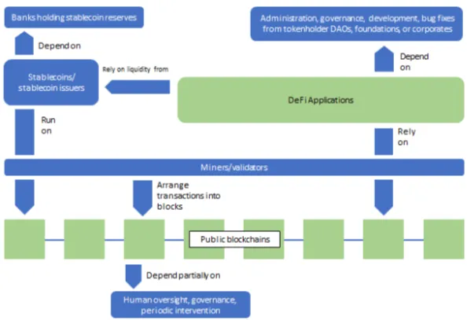

# DeFi 위협
- DeFi가 제공하는 상호 운용성에 대한 약속은 거의 모든 DeFi 프로젝트가 이더리움에 집중되는 결과를 낳았음
    - 새로운 형태의 집중 위험
- 최대한 사람의 개입을 제거하고 자동화하려다보니 코드 보안을 유지해야 하는 과제를 포함하여 새로운 위험이 도입되거나 증폭됐음
- DeFi의 성장은 전통적인 금융과의 호환성을 탐색하고 구축하는 능력에 달려 있음
    
    → 또한 국가 및 주 법률과 규정이 어떻게 발전하는 지에 달려 있음
    
- 가장 큰 과제는 DeFi 생태계가 계속 성장하는 반면, 기본 레이어(비트코인, 이더리움)는 높은 수수료가 발생함
- DeFi 시스템은 누구나 다른 모든 사람의 거래를 볼 수 있다는 극단적인 투명성을 제공함
    - 전통적인 금융 중개인을 배제하고 금융 서비스 제공을 자동화할 수 있는 잠재력을 제공하지만, public 읽기 권한과 무제한 쓰기 권한을 가진 공유된 공개 데이터베이스에 의존함
    - 물론 블록체인에 항목을 추가하는 주체가 충분한 수수료를 지불하는 경우에 한함
    
    → 시스템에 대한 지식, 인터넷 연결, 수수료 지불에 충분한 토큰을 가진 사람은 누구나 다른 사용자 허가 없이 상호 작용할 수 있는 스마트 컨트랙트를 배포할 수 있음
    
    → 스마트 컨트랙트는 누구나 상호작용하고 감사할 수 있도록 공개되어 있음 ↔ 새로운 형태의 위험을 야기함
    
    - 스마트 컨트랙트를 배포, 관리, 상호 작용할 수 있는 사람을 제한하는 데 필요한 전문 자격이나 라이선스 자격이 없기 때문
- DeFi 실무자들의 일반적인 목표는 금융 계약에서 인간의 재량을 제거하고 행동 규칙을 고도로 자동화된 공개 시스템에 인코딩 하는 것임
    - 하지만 실제로는 인간의 재량이 남아 있음
    - DeFi 시스템은 배포, 관리, 업그레이드되어야 하며 다른 프로토콜과의 버그 또는 악용적인 상호 작용에 직면함
    - 핵심 DeFi 프로토콜은 제어 주체의 어느 정도 인간 개입을 유지하는 경향이 있음
    - 물론 위험이 발생할 때 이를 완화하는 수단이지만, 관리자 자체가 손상되거나 악의적이라면 시스템에 잠재적인 위협이 되기도 함

 

# 여전히 중앙화된 요소
